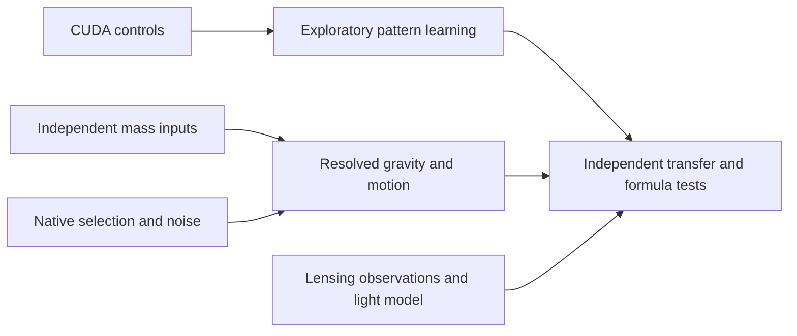

# Gravity pattern system: execution tasks

User authorization: create tasks and execute the ordinary-matter gravity pattern
system, 2026-09-06. The active goal covers the full system. This file records
dependencies and completion criteria; it does not imply every task is complete.
The coordinator publishes validated milestones to main and preserves raw data
outside Git. Independent tasks own separate files in the shared checkout.

| Task | Deliverable and acceptance | Dependencies | Execution |
|---|---|---|---|
| T1: Compute and numerical controls | Run actual CUDA learning; agree with CPU and independent library; prevent held-out response leakage; limit GPU allocations | None | First milestone complete in pattern-learning-001; CuPy on RTX 5090 |
| T2: Independent baryonic inputs | Recover original geometry, reconcile units and identities, document mass-conversion assumptions without fitting velocities | None | Running: Recover independent baryonic mass inputs, thread 01a077c5-6c38-7831-9701-c97dafed68b3 |
| T3: Native gas selection and noise | Execute a native-geometry selection/injection pilot; distinguish conditional tests from validated observed covariance | None | Running: Validate native gas cube selection, thread 01a077c5-6e58-7a21-8e3b-185a99065e49 |
| T4: Observable pattern learning | Reusable nested galaxy holdouts, simple/nonlinear comparison, shuffled-feature controls, all outcomes retained | T1; existing radial data supports exploratory development now | First GPU milestone complete on 126 galaxies; resolved extension awaits T2/T3/T6 |
| T5: Lensing pilot | Ingest measured images/redshifts/dispersion for 1–3 systems; identify PSF/noise/mass-calibration gaps and required light-propagation model | None for ingestion; gravity scoring requires a validated relativistic closure | Running: Acquire a direct-observable lensing pilot, thread 01a077c5-7055-7f80-a7d1-7ddbbe69cb4e |
| T6: Resolved matter and motion | Plausible 3D ensembles; independently checked full-field gravity; rotation/warp/streaming/pressure and instrument cube controls; observed prediction uncertainties | T2/T3; existing source/field work is development foundation | Queued for implementation after source/instrument milestone review; not an admitted likelihood |
| T7: Transfer and formula tests | Add eligible galaxies and physical group/survey holdouts; test structure additions; convert reproducible effects into dimensionally consistent formulas and test fixed predictions | T4/T6, with T5 adding a separate light-deflection test | Queued; no verified new gravity law claimed |

Execution sequence:

The first learning pass uses previously exposed radial data and photometric
summaries, not measured 3D clumps. A fresh split does not make old development
galaxies a pristine confirmation sample. All pixels of a galaxy stay together;
physical group and survey separation remain later requirements.

T5 has disclosed incidental exposure to some previously reserved SLACS table
rows while inspecting primary sources. New exact-row ingestion is confined to
three historical exploration systems. The later transfer audit must not claim
the complete historical reserved set has remained unseen.

A formula advances only when it predicts independent observables beyond source
uncertainty and motion/instrument baselines. A useful null finding is retained.
Published lens-model masses and velocity-inferred masses are not independent
baryonic training labels. Unknown depth is represented by alternatives and
uncertainty, never by an invented observed 3D truth.

## Completed execution receipts

- Historical atlas/source/field/selection milestone published to main as
  `34b156ac95e9b03a8fc27a82bb99e3727331a756`; exact manifest bytes verified in
  the Git index, 85 atlas tests passed, raw arrays excluded.
- `work/gravity-first-principles/mond-atlas-pattern-learning-001/summary.json`:
  actual CUDA nested regression, 126 galaxies, 3 fold seeds, 8 bundle/model
  comparisons and 16 structure shuffles. Independent numerical controls pass.
- Scientific result: adding the combined coarse structure summaries gives
  only a small, split-sensitive improvement. No stable structural correction
  has been established. See `mond-atlas-pattern-findings-001/README.md`.

The old filesystem/network restrictions no longer apply in this session.
PyTorch in Python313 is CPU-only, but CuPy 13.5.1 works on the 5090. No existing
environment or other process was replaced or stopped.
