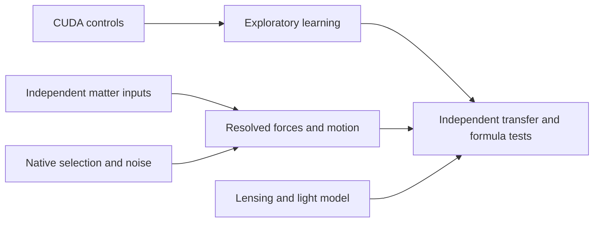

# Gravity pattern system: execution tasks

User authorization: create tasks and execute the ordinary-matter gravity pattern
system, 2026-09-06; publish validated milestones to main regularly. The active
goal covers the full system. Completion below refers to bounded increments.
Raw data stay outside Git and independently running tasks own separate files.

| Task | Deliverable and acceptance | Dependencies | Current state |
|---|---|---|---|
| T1: Compute and numerical controls | Actual CUDA fits agree with independent CPU/reference calculations; allocations bounded | None | Complete initial milestone; CuPy RTX 5090 learning and 36 new source refinements |
| T2: Independent baryonic inputs | Original metadata, registered tracer maps and explicit conversion/geometry uncertainties | None | Metadata and two conditional source pilots complete; calibration, missing phases and source noise remain |
| T3: Gas selection and noise | Native injection pilot, then validated mask and observed channel/spatial noise | None | Conditional native injections complete; observed likelihood not admitted |
| T4: Pattern learning | Nested whole-galaxy validation, simple/nonlinear baselines and shuffled controls | T1; radial data already usable for development | First 126-galaxy experiment complete; no stable structural correction |
| T5: Lensing | Measured images/redshifts plus independent mass inputs, instrument model and explicit light closure | Ingest independent; scoring requires all source/theory gates | Three-system ingest complete; light-propagation theory controls running |
| T6: Resolved gravity and motion | Source alternatives; force solver; warp/streaming/pressure/instrument and uncertainty controls | T2/T3 | Mechanics, correlated-noise and fixed-image refinement complete; pressure theory controls running |
| T7: Transfer and formulas | Expand eligible systems; group/survey holdouts; derive and test fixed physical predictions | T4/T6, with T5 supplying separate light test | Pending eligible observed likelihoods; no verified new gravity law |

Existing separately created app tasks:

- Recover independent baryonic mass inputs: 01a077c5-6c38-7831-9701-c97dafed68b3,
  bounded metadata increment complete.
- Validate native gas cube selection: 01a077c5-6e58-7a21-8e3b-185a99065e49,
  bounded conditional injection increment complete.
- Acquire a direct-observable lensing pilot: 01a077c5-7055-7f80-a7d1-7ddbbe69cb4e,
  ingest complete; light follow-up turn 01a077f6-c6ab-7cb0-8dc8-add09ac5d379 running.
- Build resolved galaxy motion controls: 01a077cf-96a5-75c3-b0e3-db86f91e6eef,
  mechanics/noise complete; pressure turn 01a077f6-c647-79f1-875b-0f1d950e6c66 running.

These live follow-ups remain THEORY_BENCHMARK_ONLY. The parent owns integration
and publication. Query task handles for fresh status before claiming completion.
Unfinished pressure/light files are excluded from execution-017 publication.

Milestones 012–016 established actual CUDA learning, original source metadata,
native selection injections, stellar registration, a lensing ingest, synthetic
motion/noise controls and a second conditional source-grid galaxy, NGC2976.
Prior execution manifests preserve evidence and failed/superseded attempts.

Execution-017 adds 36 source refinements of the SAME measured NGC2976 cells.
All converge; eight independent benchmarks pass; every private packet and CPU
projection/stationarity replay passes. Thin stellar mismatch falls from 5.23%
to .081%; CO reaches its 9.23% nonnegative floor. These are representation and
measurement diagnostics. They do not measure 3D depth or validate gravity.

Next dependency steps:

1. Review/publish the running pressure and light controls.
2. Validate signed source/beam models and actual native mask/noise behavior.
3. Add eligible registered-source pilots and checked finite-volume force inputs.
4. Test structural corrections on whole galaxies and physical groups/surveys
   withheld from selection, then test any candidate formula on fixed observables.

13525 catalog identity groups are not certified distinct systems. 175 radial
and 126 learning galaxies, 12 resolved seeds, two conditional source galaxies,
70 source-fit executions including alternatives/reruns, and 29 conditional
field runs for one galaxy are available. There are ZERO admitted observed
full-field cube or lensing likelihoods. Target remains 10–20 development pilots,
then an eligible 100–300 resolved sample and broader population tiers.

All radial learning data are historically exposed development data. Fresh folds
do not restore an unseen confirmation sample. Lensing work disclosed incidental
exposure to legacy reserved rows. Preserve that disclosure. Velocity-derived and
lens-model masses are not independent ordinary-matter training labels.
Unknown depth remains a family of assumptions. A formula advances only with
independent observable predictions beyond source/motion/instrument uncertainty.
