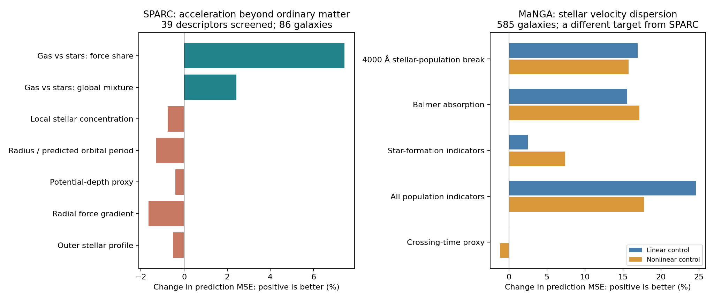

# Broad gravity-pattern search: what survives the first screen

**Two useful leads emerged: stellar-population information predicts stellar motions, and the gas-versus-stars contribution predicts a small part of the galaxy acceleration discrepancy. Neither establishes an additional force or an age-dependent gravity law.** Much of the latter lead can be absorbed by changing the assumed conversion from starlight to stellar mass.

The empty-space explanation is set aside as requested. We mapped the existing **45 mechanism families** into an explicit inventory and ran the measurable statistical comparisons below. This is a broad finite screen, not a claim to have exhausted all possible theories. A statistical feature, an algebraic rewrite and a physical mechanism are different things.

## What was actually tested

| Test | Data | What was predicted |
|---|---|---|
| Acceleration residual screen | 86 SPARC development galaxies; 1,684 eligible positions, 1,654 scored on common acceleration support | Observed radial acceleration beyond an acceleration-only relation |
| Population/history proxy screen | 585 existing MaNGA development galaxies | Stellar velocity dispersion within one effective radius, controlling for mass, size, shape, color, redshift, brightness and signal quality |
| Transfer of population models | Models trained on the 585 galaxies, then applied unchanged to 243 different development galaxies | The same stellar-dispersion observable |
| Disturbance and structure screen | Those 243 MaNGA galaxies, with separate nested cross-validation | Whether asymmetry, clumpiness, bars and tidal features add information beyond structure and stellar-population indicators |

No reserved confirmation responses were opened. These are previously exposed development samples. The galaxy transfer is disjoint in identity, but uses the same survey and is not an independent observing pipeline. SPARC and MaNGA results predict different targets and cannot be combined into one accuracy ranking.

SPARC used 39 descriptors: 28 source descriptors, four explicitly marked acceleration/radius rewrites and seven measurement/coverage diagnostics. Each descriptor was offered linear, saturating and quadratic responses, with or without weak-acceleration activation and three regularization strengths. A combined model was also tested: **705 statistical specifications per fitting stage**, not 705 distinct physical theories. Inner galaxy folds selected candidates; outer galaxies only evaluated them. A second split, an alternative acceleration baseline and source/quality sensitivities were also run.

The inventory includes density, geometry, composition, internal/external surroundings, gradients, timescales, history, thermodynamics, motion dependence, nonlocal fields, changing coupling, screening, modified inertia, additional field modes and other action-level theories. The last groups need a concrete forward prediction and appropriate observations before they can be tested as theories. The linked inventory distinguishes newly tested proxies, indexed historical results and unmeasured mechanisms.

## 1. Stellar-population history is the clearest predictive lead

Spectral features associated with the stellar population added information even after the structural controls. A larger 4000 Å break was associated with larger stellar velocity dispersion at matched control values in every linear-model fold. This is an age/metallicity/population indicator, not a stopwatch for an orbit.

| Added information | Improvement in held-galaxy squared error: linear baseline | Improvement: nonlinear tree baseline |
|---|---:|---:|
| 4000 Å break alone | 16.9% | 15.7% |
| Balmer absorption indices | 15.6% | 17.2% |
| Star-formation indicators | 2.5% | 7.4% |
| All population indicators | **24.6%** | **17.8%** |
| Source-only crossing-time proxy | −0.05% | −1.18% |

The full population model improved the separate 243-galaxy sample by **23.4% with the linear model and 14.7% with trees**. The tree full-population transfer interval narrowly included no improvement; the break-only transfer improved 14.0–16.8%, with the descriptive bootstrap intervals positive in both model classes. Tightening signal-to-noise or removing low-dispersion measurements retained the positive full-population effect, although some intervals widened.

This new check supports the earlier project age-proxy lead, which had been omitted from the preceding conversational answer. It does **not** show that an old stable orbit experiences a stronger force. Ordinary formation history, different orbit mixtures, stellar mass-to-light ratios and population-dependent measurement effects could account for the result. The target was velocity spread, not a residual after a complete baryonic gravity calculation.

We checked the actual MaNGA DAP 3.1.0 source: `SPECINDEX_1RE` takes the uncorrected spectral-index median, rather than explicitly applying the fitted velocity-dispersion correction to that median. That avoids one specific shortcut, but shared spectra, line broadening, emission subtraction and age/metallicity degeneracy still prevent an independence or causality claim. The pipeline source receipt and excerpt are saved with the population results. [Official DAP source](https://github.com/sdss/mangadap/blob/3.1.0/mangadap/survey/dapall.py), [SDSS pipeline description](https://www.sdss4.org/dr17/manga/manga-analysis-pipeline/).

## 2. Gas-versus-stars composition helps, but mass assumptions explain much of it

In SPARC the best individual descriptor was the bounded, signed atomic-gas share of the modeled ordinary-matter radial force. At comparable total predicted ordinary-matter acceleration, gas-dominated positions tended to have a smaller residual than star-dominated positions. This is a component-force share, not a direct local gas-density measurement.

It improved held-galaxy log-acceleration squared error by **7.4%** in the primary split and **6.6%** in the second split. The primary fractional-speed and absolute-speed errors also improved, by 5.9% and 6.4%. Across the specified source/quality alternatives its log-acceleration gain ranged from roughly 5% to 12%. Its galaxy-bootstrap interval nevertheless included no improvement.

The fully nested procedure that selected among all physical descriptors improved 3.8% in the main split and 6.6% in the second, but **worsened 4.4% in the quality-1 subset**. Thus the search itself does not give a uniformly reliable winner. A 99-draw whole-galaxy sign-flip null produced an approximate exceedance of 0.01 for the main selector. That is a limited search-optimism diagnostic under residual-symmetry assumptions, not discovery significance; it does not include the earlier research history or all source uncertainties.

A post-screen control allowed a single common stellar mass-to-light ratio to be chosen using training galaxies only. The allowed disk ratios were 0.3 through 0.8, with bulge ratio 1.4 times disk. Compared with the fixed 0.5 assumption, calibration alone improved squared error by **6.5%**. Adding composition beyond that gained only **1.9%**, with an interval spanning no gain. The baseline selected the upper bound, 0.8, in every fold. This is a diagnostic of degeneracy, **not an independently measured stellar mass ratio**. A flexible acceleration relation and a mass conversion calibrated on dynamics cannot establish the correct stellar population model.

A constructed mass-mismatch simulation is preserved, including its negative prediction gains; it did not demonstrate that every composition correlation is caused by mass error. The real-data calibration comparison establishes sensitivity to that assumption, not a unique explanation.

## 3. Most other measured descriptors did not produce stable extra information

| Possibility | Current result |
|---|---|
| Local stellar surface density | No stable incremental gain; consistent with the preceding matched-concentration result |
| Physical radius and predicted orbital period | No gain; both worsened the main score about 1.3% and the second split about 3.3% |
| Potential-depth proxy | No consistent gain; finite profile and assumed outer continuation limit its meaning |
| Radial force gradient | No gain in the main split, second split or tested quality subsets |
| Inner/outer stellar profiles and source-force contrast | No robust leading predictor in this screen; about 41% of doubled-radius comparisons lack measured profile coverage |
| Imaging asymmetry, clumpiness, bars and tidal features | Model-dependent: all disturbance features worsened the linear-model score 14.1%, but improved the tree-model score 6.5%; not a stable universal correction |
| Distance, inclination and data quality | Retained as diagnostics, never eligible to become a gravity law |

“No incremental gain” does not mean these physical properties are irrelevant. Many already enter ordinary-matter gravity, or may matter through a different observable than the proxy tested here. The radial light fractions inside and outside the observed range are complementary; they are not independent mechanisms. Likewise period, circular speed, angular momentum and a spherical-equivalent density calculated from radius and ordinary-matter acceleration are algebraic rewrites. The actual galaxy volume density and orbit age remain unmeasured.

## Limits, verification and next discriminating test

The source hashes, raw stored dispersions, reserved-sample exclusions, disjoint sample identities and saved prediction metrics passed checks. Changing an outer fold's target did not alter its selected model or predictions. A constructed conditional composition effect was recovered with a 99.1% reduction in error. An unconditioned injection was only partly recovered (47.6%); this counterexample is retained because the search cannot claim equal sensitivity to all possible effects.

The bootstrap intervals resample saved galaxy losses rather than refitting a complete hierarchical uncertainty model. They do not cover all distance, inclination, mass conversion, correlated-noise and selection uncertainties. Missing exterior profiles were imputed using training information and supplied no measured correction at missing positions; they were never treated as physical empty regions. Published radial profiles are not a new full-cube warp/streaming validation. No result here advances the cluster, lensing, Solar-System, conservation or stability gates for a new law.

The most useful next comparison is **whether a stellar-population-informed, independently calibrated ordinary-matter mass model removes the composition/history signal from an actual gravitational acceleration residual**. If it does, we have improved the matter model. If a reproducible discrepancy remains, it can motivate a gravity term. Direct orbit age, full three-dimensional topology, surrounding baryonic fields, magnetic/cosmic-ray support and historical field evolution need additional matched observations; lack of a measurement is not a negative test.

The finite inventory and complete feature scores are in `hypothesis-inventory.csv`, `hypothesis-inventory.json` and `sparc-family-scores.csv`. Existing historical receipts are indexed for follow-up, not automatically accepted as new validation. Raw observations remain outside this milestone's additions.

Reproduce with `scripts/run_gravity_broad_patterns.py`, `scripts/run_gravity_population_patterns.py`, `scripts/check_gravity_composition_mass_calibration.py`, then `scripts/verify_gravity_broad_patterns.py` in a clean result directory. The numerical work uses NumPy/SciPy and scikit-learn; this tabular screen took minutes on CPU and did not require CUDA. Inputs, split rules and fitting budgets are in `configs/gravity_broad_pattern_search_v1.json`. The population disturbance recheck was specified in its runner before its new scores and is an additional development comparison.

[SPARC data definitions](https://astroweb.cwru.edu/SPARC/) and [SDSS MaNGA catalog definitions](https://www.sdss4.org/dr17/manga/manga-data/catalogs/) describe the distinct source products. The familiar acceleration relation is the baseline, not a new result of this search.

