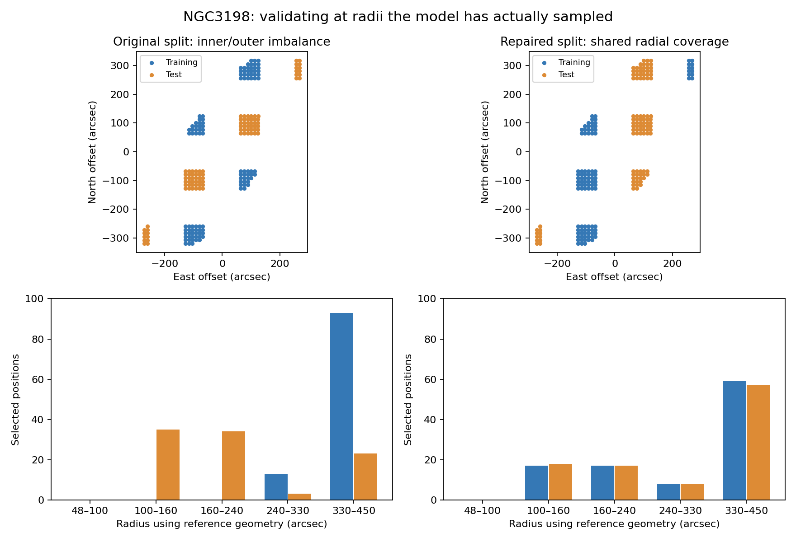
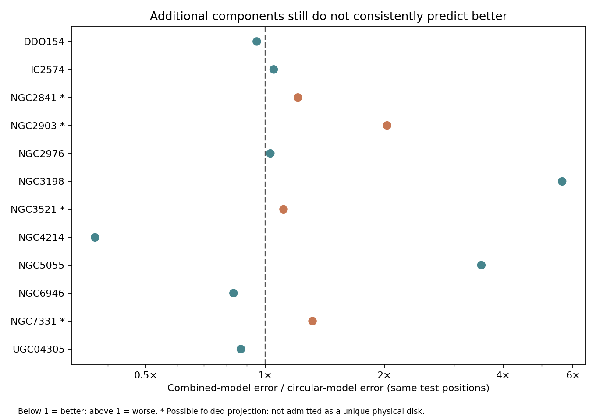
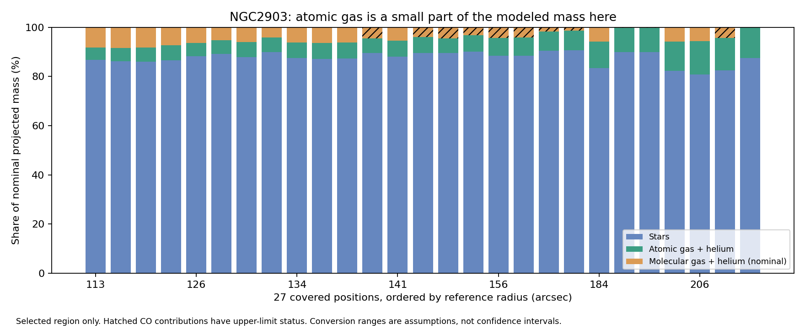

# Next diagnostic round: trustworthy geometry before gravity formulas

The most useful finding is that **a weak HI signal cannot stand in for low total matter density in our checked region of NGC2903**. The source work now combines stars, atomic gas and molecular-gas measurements, after correcting a real coordinate offset. The kinematic work removed artificial rotation reversals and repaired an important training/test design error. It still does not validate a new gravity formula.

## What changed in the motion model

The single-disk rotation curve now retains one rotation direction, starts at zero at the center, and has finer inner rings. Gas dispersion can vary with radius. Several fixed starting guesses are ranked only by training loss. Warps, radial streaming and broad lagging profiles remain separate candidates and are also combined. This is a conditional projected cube model; a realistic finite-thickness emitting disk with complete instrumental response remains necessary for a full physical interpretation.

The first constrained run revealed a selection problem. In NGC3198, the original training set had no positions below 240 arcsec, while most test points were inside that radius. A flexible inner rotation curve was therefore unconstrained. New block labels balance radius and projected rotation-side geometry, retain at least eight training and eight test points in each admitted radial bin, and preserve at least 120 arcsec between training and test centers. Mutation tests confirm that changing the velocity cube or intensity template cannot change these labels. Initial motion estimates were recomputed from the new training spectra; old fitted parameters were not reused across that change of split.

The old and new test sets differ. Their absolute error scores must not be interpreted as a pure improvement in the physical model. Within the repaired split, all five candidate models use the same test positions.

## A numerical correction and a remaining physical ambiguity

The six-step approximation to warped-ring radius was insufficient in four galaxies. Even 20 steps remained insufficient in two. A bracketed root solver now determines radius and uses implicit differentiation during fitting. It agrees with an independent scalar Brent solver to about 0.00013 arcsec in the control and passes finite-difference gradient checks. All final objects passed root residual and 36-versus-52-step precision checks; the largest residual was 0.000336 arcsec.

However, accurately solving one radius does not mean there is only one physically relevant intersection of the line of sight with a warped disk. A conservative scan flags possible folded projections in **NGC2841, NGC2903, NGC3521, NGC7331**. These cases require a model that sums emission through the disk rather than interpreting a single projected sheet. They are excluded from the final gas-term comparison.

| Galaxy | Combined test loss | Error relative to rotation | Projection-fold scan |
|---|---:|---:|---|
| DDO154 | 2.80 | 0.95× | not flagged |
| IC2574 | 12.13 | 1.05× | not flagged |
| NGC2841 | 2.77 | 1.21× | flagged |
| NGC2903 | 7.63 | 2.03× | flagged |
| NGC2976 | 6.01 | 1.03× | not flagged |
| NGC3198 | 15.47 | 5.63× | not flagged |
| NGC3521 | 41.06 | 1.11× | flagged |
| NGC4214 | 7.04 | 0.37× | not flagged |
| NGC5055 | 5.04 | 3.52× | not flagged |
| NGC6946 | 1.09 | 0.83× | not flagged |
| NGC7331 | 2.73 | 1.32× | flagged |
| UGC04305 | 2.91 | 0.87× | not flagged |

59 of 60 selected model fits converged. The combined model improves the same-test-position score in 4 of 12 objects, but greater flexibility often worsens predictions. Do not choose a physical explanation just because its test score happens to win. Most scores retain substantial excess residuals. Channel covariance is included, but spatial covariance and background nonstationarity remain limitations; these are comparative losses, not calibrated chi-square significance. NGC5055 and NGC6946 had especially uneven background-noise validation in the earlier audit.

## Independent simulation checks

An independent NumPy generator produced analytic rotation and varying dispersion at twice the fitted spatial resolution. It also produced warped, streaming, and vertically layered lagging cases; the latter included Hanning channel smoothing. The streaming model reduced the known-streaming case from about 7.72 to 1.05 in withheld whitened loss. The warped case exposed radial-shape mismatch and optimizer limitations. The thick lagging case could be matched almost as well by a thin rotating model at the simulated resolution and noise. That is an identifiability warning: a good spectral fit alone cannot establish depth, thickness, or a unique flow mechanism.

## Stellar and molecular matter: an actual source-data advance

Gaia DR3 foreground stars supplied an independent positional check. Each field used separate calibration and validation stars to compare the ambiguous FITS SIP distortion interpretation with linear TAN coordinates. All 12 preferred TAN on calibration stars, but only NGC2903 passed the strict full gate. Its 67 catalog stars yielded a validation median offset of 0.17 arcsec and a 90th percentile of 0.42 arcsec. Applying the ambiguous SIP coefficients gave a median validation offset of 10.23 arcsec instead. Failed gates elsewhere can reflect undetected infrared counterparts, so they do not prove every other map is astrometrically wrong. Proper motions were propagated to an approximate source epoch; this remains part of the alignment uncertainty. [Gaia programmatic data access](https://www.cosmos.esa.int/web/gaia-users/archive/programmatic-access).

The NGC2903 cleaned stellar cutout also had a relative shift of (-3,-1) original-image pixels, about 2.37 arcsec. After applying that coordinate correction in memory, stellar plus nonstellar emission reconstructs the Gaia-checked image at 1.15% RMS on validation spatial blocks, after calibration-only scale/background adjustment. The original FITS files are unchanged. The failed first transfer and the source-only development diagnostic are retained.

All nonzero ICA mask labels, including negative labels, were excluded according to the publisher's documentation. HI, stars and CO were brought to a common nominal 48-arcsec Gaussian beam, accounting for their native beams. Only **27 of 242** original geometric positions pass the joint 98% support requirement. Blank or missing regions remain unsupported, never measured empty space. [S4G product and mask definitions](https://irsa.ipac.caltech.edu/data/SPITZER/S4G/docs/P5_README.html).

Within these 27 selected positions, HI plus associated helium contributes a median **6.5%** of the nominal modeled projected baryonic mass. Illustrative conversion/error extremes move that median to roughly **4.5–10.0%**. Stars dominate this selected region. This is not a whole-galaxy fraction or a calibrated confidence interval.

The stellar conversion uses a nominal 3.6-micron mass-to-light ratio of 0.6, with 0.4 and 0.8 sensitivity cases. CO uses nominal alpha_CO=4.35 including helium and R21=0.65, with broader illustrative alternatives. These are source-model assumptions, not parameters fitted to the gas-motion test. [Stellar light-to-mass calibration](https://arxiv.org/abs/1402.5210), [CO conversion-factor review](https://arxiv.org/abs/1301.3498).

Twelve of the 27 positions have CO below the conservative three-error threshold. Their upper-limit information is retained, along with signed CO intensity. Smoothing the error map supplies a fully correlated-noise upper bound rather than assuming independent pixels. The HERACLES integration window partly uses the local HI mean velocity, so these tracer products are not completely independent of HI kinematics. [HERACLES release definitions](https://www.iram.fr/ILPA/LP001/README).

This is a **projected surface-matter pilot**, not a complete galactic mass distribution or a 3D volume-density measurement. Stellar and HI measurement errors, CO-dark gas and conversion uncertainty, source coverage, and line-of-sight thickness still limit a gravity calculation. In particular, a low HI patch is not enough to classify a region as a total-density void.

## The unchanged gas descriptor after these repairs

The same covered-HI descriptor and beta grid were repeated against the corrected baseline. Eligibility now also requires no flagged projection fold and passing numerical geometry checks. 7 galaxies qualified; 0 selected a nonzero beta when the coefficient was chosen using other galaxies' training spectra. DDO154: beta=+0.00; IC2574: beta=+0.00; NGC3198: beta=+0.00; NGC4214: beta=+0.00; NGC5055: beta=+0.00; NGC6946: beta=+0.00; UGC04305: beta=+0.00.

This is a limited development check of `v -> v*(1+beta*C_HI)`, with beta spacing 0.05 and frozen nuisance parameters. It is not a test of total-density coherence, and it does not rule out smaller coefficients, other source descriptors, or different physical field laws. Earlier zero-beta results from the flawed split and approximate geometry should not be promoted as decisive null evidence.

## What this means for the gravity search

We have repaired identifiable numerical and selection errors and obtained a checked multi-tracer source region. We have not established a universal anomalous-gravity pattern. The next physical requirement is a forward model that sums emission through a finite-thickness warped disk, including possible multiple intersections and the full instrumental response, then a source mass model with explicit coverage and uncertainty. A free rotation curve can absorb a smooth radial gravity enhancement; testing the gravity law itself requires that mass-constrained comparison. [3D tilted-ring fitting methodology](https://arxiv.org/abs/1505.07834).

Evidence directories preserve the original and repaired partitions, all optimizer starts, failed checks, source queries and hashes, root controls, and final descriptor predictions. Large raw observations and prepared arrays remain outside Git. The first-principles gravity goal remains unfinished; no law is admitted.
