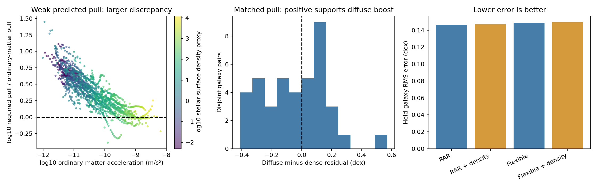

# Matched gravity and stellar concentration: first findings

**We did not find a reliable extra boost associated with lower stellar concentration after matching ordinary-matter acceleration. The strong pattern remains the acceleration discrepancy itself.** This is a completed development test, not confirmation of a new gravity law.

## What we measured

We used the existing 139-galaxy exploration sample from SPARC, preserving the reserved confirmation sample. Quality, inclination, velocity-precision, positive-source and minimum-row requirements retained **86 galaxies and 1,684 radial positions**. Whole-galaxy prediction comparisons used **1,657 positions in all 86 galaxies**, with the remaining 27 excluded from scoring because nearby training examples did not cover their acceleration/concentration combination. Every model was scored on the same positions, and every galaxy received equal total weight.

The source variable was **stellar surface mass density**, calculated from published inclination-corrected disk and bulge light profiles using fixed mass-to-light ratios. These are radial profiles, sometimes including extrapolated light; they are not directly measured three-dimensional neighborhoods. The ordinary-matter acceleration included the published signed atomic-gas contribution plus disk and bulge gravity. The signed gas term preserves outward radial contributions near central gas holes.

This tests a readily available stellar-concentration proxy for the coherence idea. It does **not** measure total volume density or establish that any sampled location is a physical void. The SPARC decomposition does not provide a complete independently measured molecular-gas component for every galaxy.

## The matched comparison

We made **40 disjoint pairs**, with each galaxy appearing at most once. Each pair had ordinary-matter acceleration within 0.05 dex (about 12%), but stellar concentration differing by at least a factor of 3.16. The median concentration contrast was **7.0 times**. Pair selection used source quantities, not the observed motion outcome. A fixed published acceleration relation corrected the small remaining acceleration mismatch.

- The less concentrated member required more residual pull in **19 of 40 pairs**.
- The mean diffuse-minus-dense residual was **−0.034 dex**; the pair-bootstrap 95% stability interval was **−0.100 to +0.035 dex**. This spans either direction.
- The raw pair spread was substantial, but there was no consistent preferred direction supporting the proposed diffuse boost.

These intervals describe this development sample and pairing procedure, not calibrated discovery significance or a causal effect. Pairs do not share galaxies, but common source systematics remain possible.

## Could concentration predict another galaxy?

We repeatedly trained on every galaxy except one, then predicted the omitted galaxy. We compared both a one-scale radial acceleration relation (RAR) and a flexible acceleration-only curve with versions adding one concentration coefficient. Concentration was first adjusted for its average relationship with acceleration using training data only. No omitted galaxy's motion entered its model fitting.

| Baseline | Prediction RMS, acceleration only | With concentration | Change in mean squared error |
|---|---:|---:|---:|
| Fitted RAR | 0.14634 dex | 0.14714 dex | **1.09% worse** |
| Flexible acceleration curve | 0.14869 dex | 0.14946 dex | **1.04% worse** |

The fitted concentration coefficient was about **+0.011**, opposite the negative sign expected if diffuse regions receive the additional boost. Its magnitude corresponds to only about 2.6% more predicted acceleration for a tenfold concentration increase at otherwise matched acceleration. This is not a detected physical effect: held-galaxy prediction did not improve.

All listed galaxy-bootstrap intervals for score changes included zero. Altering the stellar mass-to-light ratio to 0.4 or 0.6 did not rescue the prediction. Restricting inclination to 40–75 degrees gave essentially no change. Restricting to quality-1 galaxies gave a small 1.6–2.0% improvement, but still with the opposite-sign coefficient and uncertainty spanning no improvement. We do not select that subset after the fact as a successful model.

## Where Newton's ordinary-matter prediction comes closest

The following are **medians of per-galaxy median pull ratios** within each acceleration band, so densely sampled galaxies do not dominate. A ratio of 1 means that the estimated ordinary matter supplies the pull required by the published rotation curve. These are descriptive ratios under the assumed mass model, not precise demonstrations of equality or failure in every object.

| Ordinary-matter predicted acceleration | Sampled galaxies in band | Typical required pull / Newtonian ordinary-matter pull |
|---|---:|---:|
| Below 10⁻¹¹ m/s² | 57 | **4.77×** |
| 10⁻¹¹ to 10⁻¹⁰ m/s² | 65 | **2.54×** |
| 10⁻¹⁰ to 10⁻⁹ m/s² | 34 | **1.35×** |
| At least 10⁻⁹ m/s² | 9 | **0.96×** |

Galaxies can contribute to several bands. The highest band contains only 61 positions and does not imply that every position agrees with Newton. A ratio below one is retained as a mass/geometry/model discrepancy rather than clipped into a positive dark-matter component. The broad trend reproduces a known SPARC pattern; it is not a new independent discovery and does not distinguish dark matter from modified gravity.

## Checks and practical limits

- Independently re-downloaded the official SPARC mass-model archive and verified all **2,720 exploration rows**, including brightness and velocity strings, against the existing local assets. Authenticated the metadata table by its recorded hash. The older local ZIP path was only a Git LFS pointer; its contents were not used as data.
- Recomputed saved acceleration units, signed gas contributions, per-galaxy scores and matched-pair differences independently. Replayed selected held-galaxy predictions. Verification passed.
- Changing a held-out galaxy's motion did not change its predictions or source-based pairing.
- An acceleration-only synthetic input returned no RAR concentration term. An injected coefficient of −0.15 was recovered at −0.150 and improved prediction. This checks computational sensitivity to that specified effect, not power to detect every possible physical model.
- In 64 diagnostic simulations with **no true density term**, shared galaxy-wide stellar mass errors of 0.1 dex plus scatter produced fitted coefficients ranging approximately −0.017 to +0.025 over the central 95% of draws. The real coefficient lies inside that range. This illustrates how shared source errors can produce small apparent correlations; it is not a full uncertainty posterior or formal null probability.
- Distance, inclination, stellar-population, molecular-gas and correlated measurement uncertainties are not fully marginalized. The grouped bootstrap resamples saved cross-validation losses rather than refitting an entire hierarchical measurement model.
- These are **published rotation-curve profiles**, not a new full-cube warp/streaming fit. The separate THINGS cube campaign's projection and covariance limitations remain. No profile correlation here could substitute for that kinematic validation.

**Interpretation:** retain the acceleration-linked enhancement as the main empirical target. This particular linear stellar-concentration correction has not earned a place in the formula. Total-density coherence, environmental dependence and multiscale arrangements remain untested by this result. A useful next distinct test would measure external surroundings or multiscale structure independently, rather than repeatedly retune this same local stellar proxy.

## Reproduction and sources

Run `scripts/run_gravity_matched_concentration.py` with the project's Python environment. It refuses to overwrite a populated result directory; reproduce in a clean checkout/output location. Run `scripts/verify_gravity_matched_concentration.py` after placing the official archive at the private path recorded in `source-retrieval.json` (or updating that receipt with a verified retrieval). Runtime dependencies: Python, NumPy, SciPy and Matplotlib. This small tabular calculation does not need CUDA.

The fixed pre-scoring development protocol is in `configs/gravity_matched_concentration_v1.json`. Results, individual predictions, disjoint pairs, controls, input hashes and verification are saved alongside this report. The protocol was fixed before this scoring run, but it is not a public preregistration and these data have been used in earlier project exploration.

- [SPARC source database and mass-model definitions](https://astroweb.cwru.edu/SPARC/)
- [Lelli, McGaugh & Schombert 2016: SPARC mass models](https://arxiv.org/abs/1606.09251)
- [Lelli et al. 2017: radial acceleration relation and residual tests](https://arxiv.org/abs/1610.08981)

