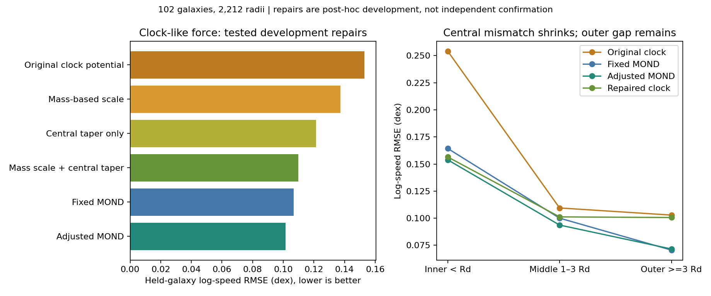

# Real-data tests of gravity relay and clock-like potentials

The strongest development result is a repaired clock-like force shape: combining
a mass-derived response scale with a central taper reduced its original squared
prediction error by **48.56%**. It still has **5.75% more error than fixed MOND**
and **16.92% more than adjusted MOND**. No new family beats the adjusted baseline.
This is progress on a mathematical shape, not evidence that time generates energy.

## What was actually tested

The initial frozen grid contained 713 settings in eleven formula families.
It ran on the NVIDIA RTX 5090 with CuPy, using real SPARC rotation data: 102
eligible galaxies and 2212 radii from 139 previously exposed development
identities. Source quality, inclination, scale and row eligibility excluded 37
galaxies under the predeclared rules. The fit runners opened no reserved galaxy
archive member bodies. An earlier source-audit schema inspection displayed some
existing response rows from minified JSON; the exposure disclosure is retained.

Each galaxy's predictions used global parameters selected from other galaxies.
Five whole-galaxy folds were repeated with three fixed seeds. Galaxies have equal
weight; radii have equal weight within each galaxy. Predictor inputs were ordinary
matter force templates, photometry and HI metadata. **Parameters were trained on
observed velocities**; they were not all derived from ordinary matter alone.
No dark halo parameters, halo masses or held-galaxy speeds entered predictors.

Two additional repairs were explicitly post-hoc, motivated by the initial
development results. Each had its own frozen preflight, fixed grid and tests
before execution. Reusing this historically exposed sample cannot establish a
fresh confirmation, even with whole-galaxy parameter-selection folds.

## Main results

The metric below is equal-galaxy RMS log10 speed error, in dex; lower is better.
It is not a mean percentage speed error. Percent improvements elsewhere compare
its square, MSE. The MOND baseline is the simple algebraic radial prescription,
not a numerical AQUAL or QUMOND disk calculation.

| Formula | Original error | Error after specified repair | Interpretation |
|---|---:|---:|---|
| Newton, ordinary matter | 0.28011 | 0.25846 with global stellar mass adjustment | Large residual gap remains. |
| MOND, fixed | 0.10667 | — | Reference radial prescription. |
| MOND, global adjustment | 0.10144 | — | Wins every initial all-family training selection. |
| Absorption proxy | 0.25846 | — | All 15 selections choose zero opacity. |
| Stellar-surface-density relay | 0.11338 | — | Closest original new family; not total-density evidence. |
| Clock-like potential | 0.15295 | 0.13741 with mass scaling | 19.29% MSE improvement, still a substantial gap. |
| Clock-like potential with central taper | — | **0.10969** with mass scaling | 48.56% MSE improvement over original clock. |
| Truncated point-kernel approximation | 0.12365 | 0.11636 with mass scaling | 11.43% MSE improvement; not actual distributed 3D computation. |
| Finite p2 response | 0.13841 | 0.14781 with mass scaling | Repair worsened it; retained as a failed direction. |
| Finite p3 response | 0.11976 | 0.12326 with mass scaling | Repair worsened it. |
| Finite p2/p3 mixture | 0.11976 | 0.11650 with mass scaling | 5.38% MSE improvement; originally selected pure p3. |

The adjusted MOND model reduces MSE by 9.55% relative to fixed MOND in this
sample, but the descriptive paired bootstrap interval includes zero improvement.
It selects mass factor1.2 and acceleration factor0.5 at the search boundaries in
all 15 folds. This does not measure a new universal acceleration constant.
Boundary frequencies for every original family are preserved in the audit.
The core repair also selects boundaries; its comparison does not locate an
unconstrained optimum or remove nuisance uncertainties.

## The useful pattern: center versus outskirts

The original clock formula overpredicted average inner speeds in 84 of the 96
galaxies with inner measurements. Inner mean log10 prediction/observation bias
was +0.16771 dex, and inner RMS error was 0.25416 dex.

The repaired clock reduced that bias to +0.04498 dex and inner RMS error to
0.15650 dex. Positive inner bias remained in 58 of 96 galaxies. This is why the
central taper matters: the original added force was too strong near the center.

At outer radii (r>=3Rd), the repaired clock still underpredicts on average:
mean bias -0.06508 dex. Its outer RMS error is 0.10061 dex, versus 0.07054 for
fixed MOND, on 90 galaxies with outer coverage. The aggregate model now needs
more support in the outskirts without restoring excessive central attraction.
This is a residual pattern, not proof of its physical cause; mass, distance,
inclination, molecular material and noncircular-motion uncertainties remain.

## The repaired formula

Let M be the declared photometric-plus-HI mass proxy, d=Rd the measured disk
scale, a0 the reference acceleration, and beta/lambda global trained constants.
Set

`Psi0 = lambda sqrt(G M a0)` and `B = G M / Psi0`.

Then the additional inward radial acceleration is

`g_chi(r) = beta G M r / [(r+d)^2 (r+d+B)]`.

Total radial acceleration is the published ordinary-matter force plus g_chi;
the circular-speed prediction is sqrt(r g_total). This is a declared radial
empirical law, not a measured three-dimensional mass distribution.

- Near the center, g_chi rises proportionally to r instead of remaining finite
  and nonzero. Its spherical effective-source diagnostic is cored.
- Where d << r << B, g_chi approximately equals beta Psi0/r, allowing an
  approximately flat added circular-speed contribution.
- Far beyond B and d, g_chi falls as 1/r^2. Its equivalent enclosed source is
  finite, approaching beta M. This is not a proof of a finite physical energy
  reservoir or a measured material component.

Both central-taper variants selected beta10, lambda0.1, stellar mass factor1.2
in every fold. For the mass-scaled form, beta*lambda=1 yields the intermediate
relation v_chi^4=G M a0 when that intermediate regime exists. This is a useful
connection to baryonic mass scaling, not an independent measurement of time.
The relation concerns the extra contribution, not automatically total speed.

The prospective next repair is to separate the outer transition scale from the
central taper and intermediate amplitude, then test a frozen physically motivated
rule. Broadening a cutoff may help the observed outer deficit, but that has not
yet been fitted or validated. No more grids were expanded after this milestone.

## What the time-energy hypothesis still needs

A clock rate N can represent a conservative weak-field potential through
Phi=c^2 ln N and g=-c^2 grad ln N. This describes how a potential affects clocks;
it does not independently show that time supplies energy. Adding this expression
again when it already describes the ordinary potential would double-count it.
Here the proposed extra field is added only once.

A physical exchange theory can declare equal/opposite transfer terms,
`div T_matter=Q` and `div T_extra=-Q`, with a specified extra-field energy density,
coupling, dynamics and boundary conditions. The sum then obeys the declared
conservation equation. A static rotation curve neither measures Q nor determines
which field action produced the same static force. We have not derived Q from
clock measurements or shown that this fitted radial family follows from such an
action. [Physics derivations and primary references](physics/README.md).

The following requested branches therefore remain untested observationally:

- Storage time and delayed/recursive responses: source history or time-series
  information is absent; static data cannot identify a memory timescale.
- Actual distributed 3D mini-generators: the point approximation does not replace
  an admitted stellar/gas volume reconstruction and converged convolution.
- Reflection and absorption by intervening gas: stellar surface brightness is
  only an exploratory proxy, not measured gravitational opacity.
- Clusters, Solar System tests and lensing: this dataset supplies none of those
  likelihoods. The extra spatial metric needed for lensing is not specified.

## Source and statistical limitations

[SPARC, Lelli et al. 2016](https://arxiv.org/abs/1606.09251) supplies published
radial baryonic force templates and observed HI/Halpha rotation curves. Templates
are not independently observed speeds of individual stellar components. Gas
forces retain their signs; stellar disk/bulge templates use nominal M/L0.5/0.7
times the global factor. The mass proxy uses 0.5 times total luminosity plus
1.33 times HI mass, so it simplifies the bulge split and molecular contribution.
The surface proxy is stellar disk surface density, not total 3D density.

Distances and inclinations are held at nominal values. No full radial covariance
is supplied; we do not report chi-square discovery significance. Bootstrap
intervals resample the completed galaxy differences without refitting all
overlapping training sets. They omit search, survey and source uncertainties.
All fields outside their admitted radial scope remain blocked by the existing
source/solver admission policy. The broader research goal is unfinished.

## Audit and reproduction

Twenty new tests pass: seven initial formula tests, three mass-scale tests, four
central-core tests and six clock/energy mechanics checks. Initial CUDA predictions
agree with CPU replay within 2.34e-15 dex. Independent implementations reproduced
all initial 180 choices and 79,632 held-family predictions, all mass-repair 105
choices and 46,452 held predictions, and both central-taper families. No reserved
archive member bodies were parsed by these runners.

- [Initial independent replay](source-audit/replay/receipt.json) and [code review](source-audit/code-review.md).
- [Mass-scale repair](physics/scale-repair/README.md) and its [independent replay](physics/scale-repair/independent-review/receipt.json).
- [Central taper](source-audit/core-repair/README.md), including full frozen grids and replay.
- [All initial metrics](run001/summary.json), [all selections](run001/selections.json), and [reporting corrections](interpretation/reporting-corrections.json).
- [Combined tests](interpretation/combined-tests.json).

The original ambiguous source_only_parameters flag is explicitly corrected:
only predictor inputs are source-only; parameters used training speeds. A raw
fixed-MOND self-comparison count caused by ~1e-19 floating-point signs is corrected
to zero meaningful improvements. Frozen outputs remain unchanged; no failure was
removed to improve a score. All-family held predictions and boundary reports are
provided in the independent review supplement.

Run the initial experiment with `python scripts/run_mond_atlas_clock_relay.py
--output <fresh-directory> --backend cuda`. Private raw source paths and public
download URLs are in the configuration and audited hashes. The dedicated repair
reports describe their runners and overwrite protection. Combined tests can be
run with `python work/gravity-first-principles/mond-atlas-clock-relay-001/interpretation/verify_tests.py`.
