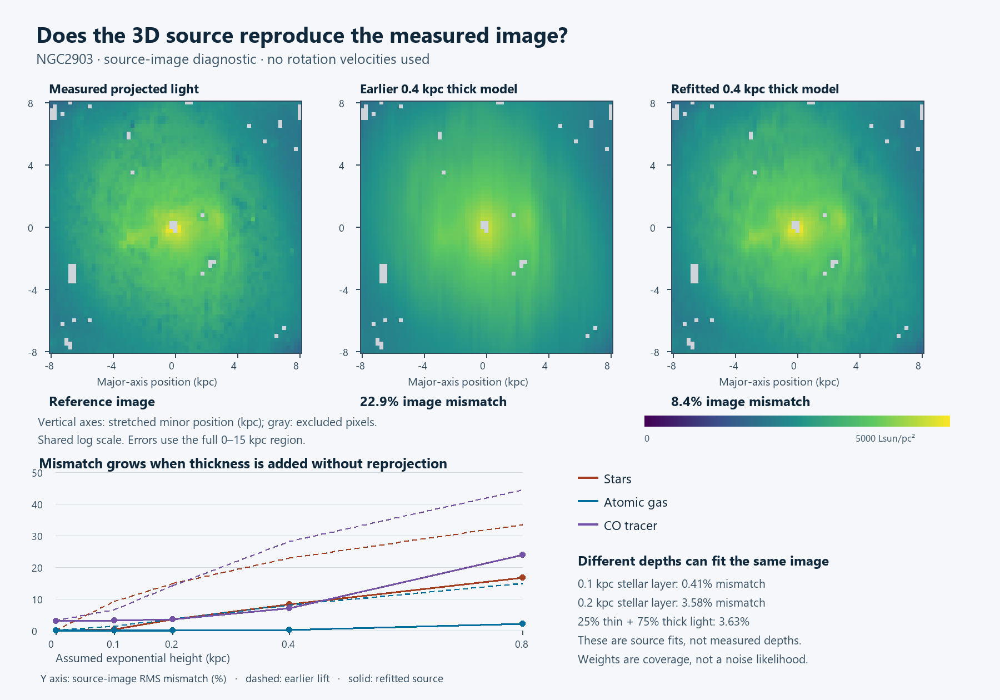

# MOND atlas — source projection changes what we can trust

**The earlier 3D construction failed an important image check.** Geometrically
stretching the observed stellar map and then adding a 0.4 kpc vertical thickness
produces a projected light pattern with **22.87% RMS mismatch** in this source
diagnostic. The field solver can accurately solve that density, but that does not
make the density a faithful model of the observed galaxy.



The image is a source diagnostic in geometrically stretched coordinates, not a
measured 3D view. All three panels use the same logarithmic scale, proportional
to the projected stellar luminosity times cos(inclination). Gray cells are not
usable source measurements. No rotation velocities enter this experiment.

## Why thickness changes the picture

An inclined thick disk projects several shifted layers onto the same image.
Repeating the geometrically stretched photograph through every layer smears the
photograph a second time. A valid construction has to find a distribution whose
projection reproduces the measured light.

For the tested flat, separable exponential family,

`rho(X,Y,z) = Sigma(X,Y) exp(-abs(z)/h) / (2h)`

the projected image is a convolution along the stretched minor direction with
an exponential kernel of scale `h tan(i)`. We integrated that kernel over source
and image cells and checked it against independent numerical line-of-sight
integration. The inverse calculation fits a nonnegative planar distribution
using only source-image values and coverage weights. It retains signed CO
measurements and does not reinterpret blank sky pixels as measured zero mass.

## Different depth arrangements can reproduce similar images

| Single stellar exponential height (kpc) | Earlier lift: image RMS mismatch | Refit planar light: image RMS mismatch |
|---|---:|---:|
| 0 | 0.00% | 0.01% |
| 0.1 | 9.16% | 0.41% |
| 0.2 | 14.79% | 3.58% |
| 0.4 | 22.87% | 8.38% |
| 0.8 | 33.39% | 16.81% |

The 0.4 kpc case still misses the stellar image by 8.38% after refitting. Smaller
heights can reproduce more of the structure. That does **not** measure the true
height: a thin model can absorb projected structure into its planar distribution.
An independent synthetic test explicitly constructs two distinct depths that
reproduce the same positive projected image.

We also allowed a shared planar light distribution to have both 0.1 and 0.4 kpc
vertical populations, with fractions fixed before this source-only follow-up:

| Light in 0.1 kpc layer | Light in 0.4 kpc layer | Refit image RMS mismatch |
|---|---|---:|
| 25% | 75% | 3.63% |
| 50% | 50% | 1.80% |
| 75% | 25% | 0.79% |

Thus, a mostly thick model with a thin contribution can resemble the measured
image better than the single thick layer. These fractions are illustrative light
fractions, not independently measured stellar masses, ages or confidence bounds.
The total recovered stellar luminosity changes by less than 1% between the pure
0.1 kpc case and the 25%-thin mixture. Their spatial-depth distributions differ.

**The 5% threshold is only a flag for a substantial construction mismatch.** It
is not a noise-calibrated acceptance rule, a posterior interval or proof that a
particular height is observationally allowed. The fits use the available source
image, not an independent withheld image. Source errors, covariance and physical
population priors still need to be included.

Atomic gas and CO were tested in the same way. At the nominal 0.2 kpc gas height,
the reconstructed HI source misses its projected image by about 0.09%, and CO
by 3.56%. CO already has a 3.15% floor for the zero-height nonnegative fit because
the measured source includes negative noise values. These percentages are not
comparable statistical significances: the tracer noise and selection differ.

## We recomputed gravity, and retained a numerical failure

Two source alternatives—pure 0.1 kpc stellar light and the 25%-thin mixture—were
lifted with cell-integrated vertical weights and combined with the refitted gas
sources. The constant stellar mass-to-light assumption makes the light fractions
conditional mass fractions. Both Newtonian and full QUMOND fields were solved.
This compares jointly changed planar and depth distributions, not height alone.

The first calculation suggests that mean force-equivalent speeds are less
sensitive than the sideways component. **The mixed model has not yet passed
the required lateral convergence test**, so its precise directional-force
differences are not a validated finding. The original failure is preserved.

| Numerical follow-up | Newtonian vector RMS difference | QUMOND vector RMS difference | Original gates |
|---|---:|---:|---|
| thin_vertical_refined | 0.202% | 0.211% | pass |
| thin_lateral_refined | 2.843% | 2.548% | pass |
| thin_larger_box | 0.004% | 0.196% | pass |
| mixed_vertical_refined | 0.114% | 0.122% | pass |
| mixed_lateral_refined | 3.527% | 3.145% | fails aggregate gate |
| mixed_larger_box | 0.004% | 0.187% | pass |

The unchanged requirements are 3% aggregate vector RMS and 5% in every radius
ring between 2 and 15 kpc. The thin model passes; the mixed model's lateral test
has 3.53% Newtonian and 3.14% QUMOND aggregate differences. Vertical and box
checks pass. The next step is finer spatial convergence, not relaxing the gates.
The small linear Poisson residuals do not override this failed discretization test.

## What this changes in the atlas

- The old conditional force results remain reproducible, but their nominal
  stellar source cannot be treated as an image-consistent 3D reconstruction.
- Future mass ensembles must project back through the observation model before
  their gravity predictions can be admitted. Preserving total mass is insufficient.
- A single projected image leaves substantial depth ambiguity. The atlas needs
  ensembles and additional independent constraints rather than one asserted 3D map.
- No new kinematic response comparisons were made in this phase. The earlier
  exploratory rotation comparison remains nonadmitted, as already disclosed.

The stellar maps and conversion assumptions come from the
[S4G ICA study](https://arxiv.org/abs/1410.0009) and
[light-to-mass calibration](https://arxiv.org/abs/1402.5210). The tracer products
come from [THINGS](https://arxiv.org/abs/0810.2125) and
[HERACLES](https://arxiv.org/abs/0905.4742). Reading those papers does not supply
missing observational covariance, geometry or mass phases.

There is also a concrete provenance gap: both raw S4G geometry tables referenced
by the stored derived configuration are absent from this workspace and from the
checked original checkout. The derived record and hashes remain available, but
the original tables must be recovered before fresh raw-record verification.

This milestone executed **18 source-image fits, 8 additional full field runs and
43 passing unit tests**. One field convergence gate remains failed. Only one
galaxy has conditional field calculations; **zero galaxies yet have an admitted
full-field cube likelihood**. The 10–20 pilot and larger resolved-sample goals
are not complete. Git publication, new shell downloads and the old CUDA runtime
remain unavailable; all new artifacts are local.

## Evidence and replay

- [Single-height source diagnostics](../mond-atlas-projection-001/source-closure.csv)
- [Image errors by radial annulus](../mond-atlas-projection-001/source-closure-annuli.csv)
- [Mixed-height diagnostics](../mond-atlas-projection-002/mixed-height-source-closure.csv)
- [Projection source assumptions and hashes](../mond-atlas-projection-001/summary.json)
- [Reconstructed-source field results](../mond-atlas-field-003/summary.json)
- [Mixed-source numerical failure](../mond-atlas-field-004/summary.json)
- [Numerical checks](numerical-checks.csv), [field integrity](field-integrity.csv)
- [Verification](verification.json), [43-test log](validation.log), [remaining work](execution-status.json)

Choose unused output directories when replaying from the repository root:

```text
python scripts/run_mond_atlas_source_projection.py --output work/gravity-first-principles/projection-replay --private work/private/projection-replay
python scripts/run_mond_atlas_mixed_source.py --output work/gravity-first-principles/mixed-replay --private work/private/mixed-replay
python scripts/run_mond_atlas_reprojected_fields.py --output work/gravity-first-principles/projected-fields-replay --private work/private/projected-fields-replay
python scripts/continue_mond_atlas_reprojected_checks.py --output work/gravity-first-principles/mixed-checks-replay --private work/private/mixed-checks-replay
python -m unittest discover -s tests -p "test_mond_atlas*.py" -v
```

The default configurations bind the original immutable source packets. To chain
a new acquisition/reconstruction instead, make new protocol copies with those
explicit source paths and retain their new hashes. Do not edit a frozen run.
