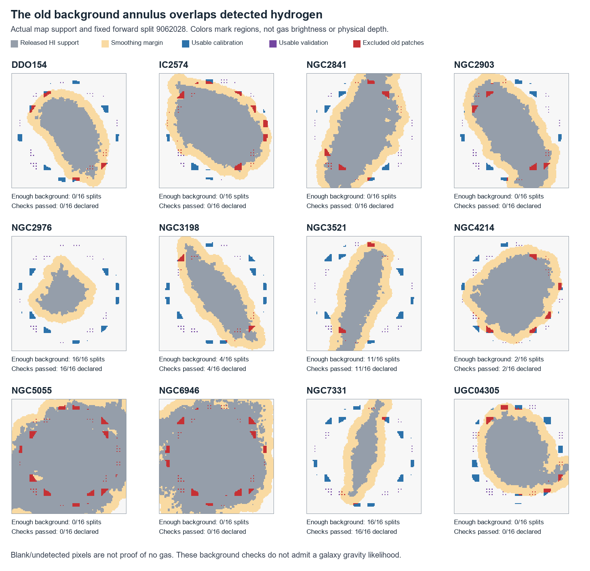

# MOND atlas: hydrogen in the supposed background

**Detected hydrogen overlaps some old background patches in 11 of 12 galaxies.**
Two objects, NGC5055 and NGC6946, passed every original noise check even though
their selected patches overlapped the released hydrogen support extensively.
Those passes never established a pure-noise region, and the new audit shows why.

After excluding the previously declared support and smoothing margin, only
**NGC2976 and NGC7331 have enough background and pass all 16 splits**. The other
galaxies remain in the catalog with their coverage failures. This changes data
readiness, not a gravity formula. The full atlas is still unfinished.



The picture uses one fixed split; the counts below include all 16. Red means an
old calibration or validation patch intersects the declared warning area. Gray
shows positive released moment-map support, not gas brightness. Orange is the
extra smoothing margin. A blank pixel is not proof of gas absence.

## Three executed checks

First, the estimated background mean was propagated into the covariance of the
validation residuals. For a calibration arithmetic mean, residual covariance is
the test covariance plus the variance of that mean, minus both test–mean cross
terms. Calibration sample variance also loses the mean mode. Independent joint
covariance algebra and simulated correlated draws verify those corrections.
The fitted covariance parameters are still uncertain; this is not an exact
predictive likelihood or a fully conditional Gaussian-process prediction.

All 192 previous partitions were reproduced, and all three declared covariance
branches were evaluated: **576 checks**. The same three galaxies remained
split-sensitive. Correct accounting for the mean was necessary but did not
resolve those failures.

Second, the released natural-weighted HI moment maps were checked against the
native cube spatial grids and file hashes. Finite positive native pixels define
detected support. A coarse cell is warned if it contains any such pixel. Support
was expanded by ceil(4 × the recorded extra-smoothing sigma / coarse pixel size)
+ 2 cells, as declared before this audit. This conservative geometric warning
is neither the publisher's original cube mask nor a predicted contamination
amplitude. Native-to-coarse support area is exactly conserved in these files.

Third, each old split was intersected with the complement of that same expanded
support. There was no rebalancing, threshold relaxation or favorable-split search.
The original 150 calibration pixels, 25 validation pixels and four validation
pixels in every quadrant were required before the corrected covariance check.

| Galaxy | Original passes | Mean/variance corrected passes | Direct HI overlap range across old patches | Enough background after exclusion | Passes after exclusion |
|---|---:|---:|---:|---:|---:|
| DDO154 | 16/16 | 16/16 | 0.0–15.6% | 0/16 | 0/16 |
| IC2574 | 16/16 | 16/16 | 10.9–32.4% | 0/16 | 0/16 |
| NGC2841 | 9/16 | 10/16 | 12.3–40.5% | 0/16 | 0/16 |
| NGC2903 | 14/16 | 14/16 | 19.4–43.5% | 0/16 | 0/16 |
| NGC2976 | 16/16 | 16/16 | 0.0–0.0% | 16/16 | 16/16 |
| NGC3198 | 10/16 | 11/16 | 0.0–30.3% | 4/16 | 4/16 |
| NGC3521 | 16/16 | 16/16 | 0.0–17.1% | 11/16 | 11/16 |
| NGC4214 | 16/16 | 16/16 | 0.0–18.9% | 2/16 | 2/16 |
| NGC5055 | 16/16 | 16/16 | 91.7–100.0% | 0/16 | 0/16 |
| NGC6946 | 16/16 | 16/16 | 81.3–100.0% | 0/16 | 0/16 |
| NGC7331 | 16/16 | 16/16 | 0.0–2.8% | 16/16 | 16/16 |
| UGC04305 | 16/16 | 16/16 | 0.7–11.3% | 0/16 | 0/16 |

The overlap ranges concern coarse calibration or validation pixels, not the
fraction of each galaxy's mass. There are **49 evaluable partitions out of 192**
after exclusion, and all 49 pass. The other 143 have insufficient support.
Crucially, these same 49 partitions already passed the mean-corrected check
before exclusion. **This is not evidence that removing HI cured the earlier
covariance failures.** NGC2841 and NGC2903 cannot be assessed with the remaining
patches under the declared requirements.

## What the spectra add

The fixed outer 15% at each end of the channel band were compared with the
central 70%, keeping lag pairs within each contiguous segment. These ends are
not certified line-free. In the fixed forward calibration split, NGC5055's
normalized adjacent-channel product is 0.446 at the ends and 0.860 centrally;
NGC6946 gives 0.431 and 0.801. Their central positive tails are also stronger.
Together with the map overlap, this is consistent with galaxy emission entering
the noise estimate. It does not establish that emission explains every anomaly:
some band ends also show strong correlations or spatial inconsistency.

The [THINGS source paper](https://arxiv.org/abs/0810.2125) documents the observation
and processing. The numerical overlap and spectral measurements here come from
the hashed local observation products, not from a published gravity fit.

## Consequences for the atlas

The catalog still contains **13,525 identity groups**, with unresolved identities
explicitly retained; this is not a certified unique-galaxy count. The radial
baseline remains 175 galaxies, with 126 passing its descriptive cuts. There are
12 resolved seed galaxies, 22 source-image fits and 29 conditional field runs
for one galaxy. There are **zero admitted full-field galaxy cube likelihoods**.

The earlier force result remains useful: in two conditional NGC2903 source
reconstructions, almost the same total mass and similar in-plane force coexist
with substantially different vertical force. That is a reason to seek independent
depth-sensitive observations, not evidence of a measured failure of Newton or
MOND. See the [preserved field report](../mond-atlas-execution-008/README.md).

Next required work is to recover or reconstruct and validate the native selection
and line-free definitions, including signal-injection recovery and dependence on
the same observation. A useful noise model must transfer into the galaxy region
and include the actual spatial/spectral instrument response. Source photometry,
mass conversions, depth/exterior-field ensembles, additional pilots and survey
holdouts remain required. The two surviving background diagnostics do not certify
those other requirements or supply independent stellar masses.

## Reproduction and preservation

All new packages were declared SOURCE_BLOCKED before implementation and scored
no new galaxy motions. All original seed objects remain development-exposed.
The atlas unit suite passed **67 tests** on the code bound by this report.
The preceding manifest's 357 files were verified before updating the handoff.
Raw FITS observations and large numerical fields remain outside Git.

Run the three scripts with new immutable output directories:

```text
python scripts/run_mond_atlas_noise_mean.py --output <new-mean-directory>
python scripts/run_mond_atlas_background_support.py --output <new-support-directory>
python scripts/run_mond_atlas_emission_excluded_noise.py --output <new-exclusion-directory>
python -m unittest discover -s tests -p "test_mond_atlas*.py" -v
```

The source and partition paths in the configurations intentionally bind the
original runs. Replaying an individual stage does not silently redirect its
descendants. Machine-readable details are in [pilot readiness](pilot-readiness.csv),
[control comparison](noise-control-comparison.csv), [verification](verification.json)
and the [publication manifest](publication-manifest.json).

Publication remains local. The previous connected GitHub blob write was rejected
because it requires approval while this session's policy is never. The local
linked Git metadata is also outside the writable root. No alternate write route
was attempted and nothing is claimed to have been pushed.
