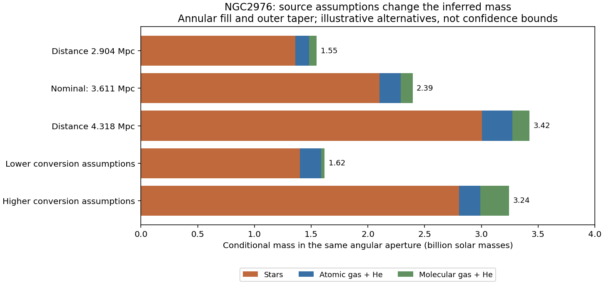

# Second conditional source pilot executed: NGC2976

The atlas now has a registered, conditional tracer packet for NGC2976 as well
as the earlier NGC2903 work. The new generic adapter uses each object's measured
stellar registration instead of a hardcoded NGC2903 offset. Twelve source cases,
36 component grids and 72 mass-conversion/fill combinations executed. **161
integration tests pass.** The larger goal remains active.

The [source report](../mond-atlas-generic-source-001/README.md) contains the
data, plots, formulas, numerical controls and all retained failures. In the
selected nominal region, usable coverage is 99.53% for stars, 78.50% for HI and
37.54% for CO. The nominal conditional mass is 2.394 billion solar masses;
conversion alternatives span 1.619–3.243 billion, and catalog-distance-scatter
alternatives give 1.549–3.424 billion. These are sensitivity cases, not posterior
intervals or independently observed masses.

Photometric orientation alternatives change assigned disk-coordinate structure
much more than the integrated mass. Those coordinate-dependent differences are
not changes in measured sky light and are not yet gravitational-force predictions.
The independent registration/area checks pass; source beams, calibration, depth,
all baryon phases and empirical covariance remain unresolved. Source processing
also retains the HERACLES use of HI windows. No new gravity field, observed-motion
likelihood or 3D source truth is claimed.

The parent rehashed all 710 entries of execution-014 before archiving and updating
the mutable handoff/task documents. All twelve private source packets, nineteen
run-002 artifacts, eight source bindings and both runs' code/input bindings match.
Changed code from the failed header run is recoverable from its original snapshots.
The two report versions have identical numeric diagnostics; the second only
corrects legend placement. The old uniform-footprint test failure is preserved,
with its enclosing-field correction and unchanged conservation tolerance.

The test list and results are in verification.json and unit-tests.log. The new
source suite has nine tests; the prior 152-test publication subset also passes.
Reproduce that subset by loading the names listed in verification.json with
Python's unittest loader, with scripts/ and tests/ on the import path. Source
construction and reporting commands are in the source report. Raw arrays remain
under work/private and are excluded from publication.

Publication base: `25045db1463ded44e641fa0e7756dbeb04ba1a8a`. The coordinator
checks every intended staged blob against the cumulative manifest, fetches main
and uses a regular fast-forward push. No shared code or prior receipt was edited.

Next source work is a common-basis reprojection over plausible vertical profiles,
followed by field/instrument convergence and additional eligible galaxies.
Separately, the existing task **Build resolved galaxy motion controls**
(`01a077cf-96a5-75c3-b0e3-db86f91e6eef`) is actively executing its correlated-channel
noise follow-up in new owned paths. Its controls pass, and partial zero-amplitude
results exist, but the study is not yet delivered or included in this milestone.
Do not restart it based on a timeout; inspect that same thread handle.
