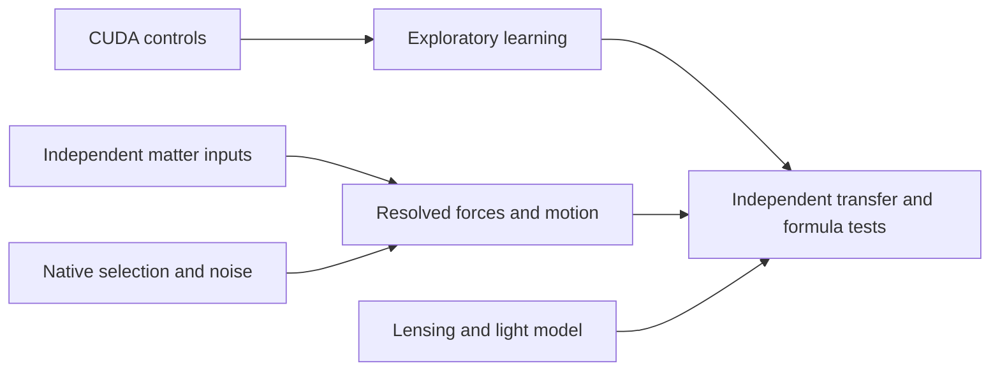

# Gravity pattern system: execution tasks

User authorization: create tasks and execute the ordinary-matter gravity pattern
system, 2026-09-06; publish validated milestones to main regularly. The active
goal covers the full system. Completion below refers to bounded increments.
Raw data stay outside Git and independently running tasks own separate files.

| Task | Deliverable and acceptance | Dependencies | Current state |
|---|---|---|---|
| T1: Compute and numerical controls | Actual CUDA fits agree with independent CPU/reference calculations; allocations bounded | None | Complete initial milestone; CuPy RTX 5090 learning and 36 new source refinements |
| T2: Independent baryonic inputs | Original metadata, registered tracer maps and explicit conversion/geometry uncertainties | None | Metadata and two conditional source pilots complete; NGC3198 source pilot executed; review/correction interrupted by usage limit; calibration, missing phases and source noise remain |
| T3: Gas selection and noise | Native injection pilot, then validated mask and observed channel/spatial noise | None | Conditional native injections complete; native background covariance reviewed and aperture transfer executed; large-aperture covariance fails; observed likelihood not admitted |
| T4: Pattern learning | Nested whole-galaxy validation, simple/nonlinear baselines and shuffled controls | T1; radial data already usable for development | GPU baseline and sparse-formula experiments complete on 126 galaxies; no stable structural correction |
| T5: Lensing | Measured images/redshifts plus independent mass inputs, instrument model and explicit light closure | Ingest independent; scoring requires all source/theory gates | Three-system ingest and light-propagation theory controls complete; observed source/instrument closure remains |
| T6: Resolved gravity and motion | Source alternatives; force solver; warp/streaming/pressure/instrument and uncertainty controls | T2/T3 | Mechanics, correlated-noise, fixed-image refinement and pressure theory controls complete; observed likelihood remains |
| T7: Transfer and formulas | Expand eligible systems; group/survey holdouts; derive and test fixed physical predictions | T4/T6, with T5 supplying separate light test | Pending eligible observed likelihoods; no verified new gravity law |

Existing separately created app tasks:

- Recover independent baryonic mass inputs: 01a077c5-6c38-7831-9701-c97dafed68b3,
  metadata complete; NGC3198 follow-up turn 01a07800-bcf4-7132-b9d6-be1212b9020b stopped at usage limit; results saved.
- Validate native gas cube selection: 01a077c5-6e58-7a21-8e3b-185a99065e49,
  native injection complete; covariance turn stopped at usage limit; coordinator review and aperture follow-up complete in execution-020.
- Acquire a direct-observable lensing pilot: 01a077c5-7055-7f80-a7d1-7ddbbe69cb4e,
  ingest and light follow-up turn 01a077f6-c6ab-7cb0-8dc8-add09ac5d379 complete; task idle.
- Build resolved galaxy motion controls: 01a077cf-96a5-75c3-b0e3-db86f91e6eef,
  mechanics/noise and pressure turn 01a077f6-c647-79f1-875b-0f1d950e6c66 complete; task idle.

Pressure and light packages remain THEORY_BENCHMARK_ONLY and are published in
execution-018 after parent review. The unfinished source/covariance review remains
SOURCE_BLOCKED and is excluded from this publication. The parent owns integration
and publication. Query task handles before changing status.

Milestones 012–016 established actual CUDA learning, original source metadata,
native selection injections, stellar registration, a lensing ingest, synthetic
motion/noise controls and a second conditional source-grid galaxy, NGC2976.
Prior execution manifests preserve evidence and failed/superseded attempts.

Execution-017 adds 36 source refinements of the SAME measured NGC2976 cells.
All converge; eight independent benchmarks pass; every private packet and CPU
projection/stationarity replay passes. Thin stellar mismatch falls from 5.23%
to .081%; CO reaches its 9.23% nonnegative floor. These are representation and
measurement diagnostics. They do not measure 3D depth or validate gravity.

Next dependency steps:

1. Finish reviewing NGC3198 source and NGC2976 covariance increments saved before usage-limit interruptions.
2. Validate signed source/beam models and actual native mask/noise behavior.
3. Add eligible registered-source pilots and checked finite-volume force inputs.
4. Test structural corrections on whole galaxies and physical groups/surveys
   withheld from selection, then test any candidate formula on fixed observables.

13525 catalog identity groups are not certified distinct systems. 175 radial
and 126 learning galaxies, 12 resolved seeds, two conditional source galaxies,
70 source-fit executions including alternatives/reruns, and 29 conditional
field runs for one galaxy are available. There are ZERO admitted observed
full-field cube or lensing likelihoods. Target remains 10–20 development pilots,
then an eligible 100–300 resolved sample and broader population tiers.

All radial learning data are historically exposed development data. Fresh folds
do not restore an unseen confirmation sample. Lensing work disclosed incidental
exposure to legacy reserved rows. Preserve that disclosure. Velocity-derived and
lens-model masses are not independent ordinary-matter training labels.
Unknown depth remains a family of assumptions. A formula advances only with
independent observable predictions beyond source/motion/instrument uncertainty.

Execution-018: pressure and light mechanics completed. Parent passes 44 tests,
rehashes 79 delivery files, exactly replays all 30 pressure predictions and
244 mathematical light records. A perfect synthetic speed fit can still
underestimate force by 36% if pressure is omitted. The separate light operator
passes analytic/asymmetric/geometry/convergence tests but supplies no candidate
relativistic closure or observed lensing likelihood. Coarse failures and
impossible equilibria are retained. The overall goal remains active.

## Execution-019: adaptive sparse formula search

Published a runnable greedy expression-search loop on the RTX 5090, with training-only transforms, nested whole-galaxy complexity selection, exact formula replay and shuffled controls. On 126 previously exposed galaxies, additions from 30 candidate expressions made outer MSE worse by 3.62%, 4.55% and 0.90% across three splits. Seven of fifteen fits selected no additional term. No expression advances as a validated gravity law. Five pre-access tests and all 110 saved formula replays passed; full first-seed CPU selection matches GPU. See `work/gravity-first-principles/mond-atlas-formula-search-001/README.md`.

This milestone adds no admitted observed full-field or lensing likelihood. The separate 16 NGC2976 conditional field calculations are saved locally, but grid refinement failed accuracy gates and their review is not included here. NGC3198 and native covariance supporting tasks stopped at usage limits; intermediate outputs remain available. Overall research goal is unfinished.

## Execution-020: measured background uncertainty transfer

Completed review of the interrupted native covariance run and executed a new spatial-aperture test on its 29 western and 27 eastern NGC2976 background cores. Seventeen pre-access tests pass. Western channel models and ranking replay; independent aperture aggregation and inverse scoring reproduce six covariances and all 324 core scores. Independent-pixel variance underpredicts eastern 4x4-pixel fluctuation power by 8.13x. A western aperture model predicts eastern total power within 3.1% at all six sizes, but its full channel q/N gate fails at sides 12 and 24. Failures retained; no shrinkage retuning, source-region admission or new gravity score. See `work/gravity-first-principles/mond-atlas-aperture-noise-001/README.md`.

T3 now has reviewed native covariance and spatial-aggregation diagnostics. Its historical task stopped at a usage limit; the coordinator completed this review locally. Source-region selection/noise and a coherent joint spatial likelihood remain unresolved. NGC3198 correction and NGC2976 field-grid convergence remain separate unfinished work. Overall research goal is unfinished.

## Execution-021: fixed CMB axes and sky-position tests

Tested two published Planck SMICA KQ-corrected CMB axes, their bisector and Galactic/ecliptic/equatorial directions on 86 directly matched PROBES/SPARC development galaxies. Forty lack a direct coordinate/metadata match. Axial partial correlations are -0.042 and -0.020; adding the CMB direction terms worsens all random-galaxy and Galactic-octant prediction comparisons. Equatorial declination has the largest adjusted association (-0.276); all-sky terms offer small exploratory improvements, without a causal interpretation. Coverage is strongly uneven (45 of 86 galaxies in one octant). Four pre-access tests pass; independent sklearn replay verifies 132 nested choices and 2064 predictions. Reports, every galaxy-axis angle, exclusions and reviewed sky map are in `work/gravity-first-principles/mond-atlas-sky-alignment-001/`. This is line-of-sight analysis, not disk-spin alignment or a new gravity law. Next: coordinate completion and actual observing-reference/instrument controls. Goal unfinished.

## Execution-022: parallel relay and published halo tests

Completed three parallel agent investigations plus coordinator halo and geometry
tests: absorption/redirection, distributed secondary sources, finite memory and
feedback, and cumulative return shapes. Twenty tests pass. All 525 selected fit
rows from 175 SPARC galaxies match source tables; 504 pilot vectors independently
match galpy within 1.69e-12. This is fitted-halo calibration, not observational
validation. A manufactured distributed disk becomes nearly spherical far out,
but its inner strength differs from the point-calibrated halo. Absorption alone
weakens the tested attraction; strong feedback lengthens memory and can become
unstable. Scalar disk boosts fail off-plane vector geometry. Two finite-return
shapes interpolate NFW/Burkert well but degrade in outer extrapolation. All
failures and scope limits are retained. See
`work/gravity-first-principles/mond-atlas-relay-001/README.md`.

Next priority: a conservative distributed response with ordinary-matter rules
for strength, scale and finite extent, then real-source and held-galaxy tests.
No new observed full-field, cluster, Solar System or lensing score is admitted.
The existing data/noise and field-convergence blockers remain. Goal unfinished.
