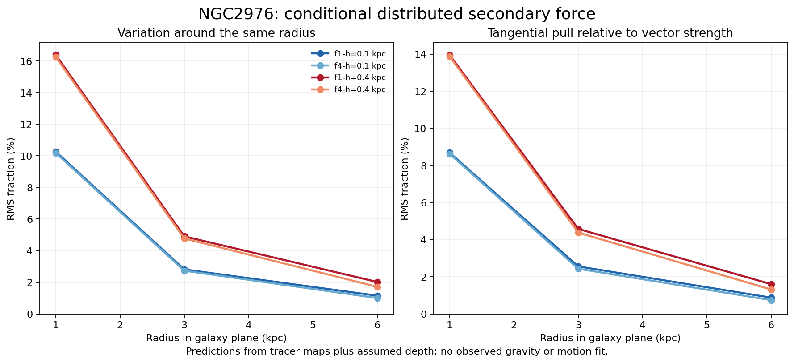

# Larger gravity program: spatial fields, evolving dynamics, and real-data noise

This milestone executes the unfinished spatial and dynamic branches and repairs
specific failures. It adds conditional real-source force calculations, evolving
motion/memory simulations, and actual-background covariance tests. It does not
establish a new gravity law or complete the full program.

## What the results say

| Branch | What was run | Useful result | Remaining challenge |
|---|---|---|---|
| Distributed secondary response | NGC2976 stellar+HI+CO maps, four conditional source models, three quadratures, 72 positions | Inner angular variation about 10–16%, falling to 1–2% farther out; largest sampled total-field refinement change below 0.075% | No observed-motion fit; unknown depth changes predictions much more than this numerical refinement |
| Density-dependent refraction | Full spatial variable-permittivity PDE and same-source Newton controls | Newton passes the finer field gate, while point-density refraction remains unresolved | Point-density field changes 13.17% with refinement; smoothed-density variants are reported separately below |
| Motion-dependent interaction | Conservative finite-particle equations; repaired source-partition law and fixed strength sweep | Source splitting no longer changes acceleration; co-/counter-rotation are useful different configurations | Tested weak coupling initially reduces inward pull; strong coupling disperses configurations |
| Memory | Two explicit internal-oscillator frequencies with orbital energy exchange | Energy can move between motion and a defined reservoir without being created | This model supplies no extra static force at equilibrium; no observed histories or relativistic propagation law |
| Noise | Western-selected aperture covariance, then a full within-core spatial/channel model | Large-aperture errors improved substantially | Full joint score fails even when aperture checks pass |
| Source recovery | Twelve NGC3198 stellar/HI/CO alternatives and 72 mass records | Distance-scaling discretization error removed; measured maps unchanged | Missing coverage, source conversions, exterior material and depth remain |

## A density response over a neighborhood is numerically usable

The local-density refraction law failed its declared grid check even after a
257-cubed solve. We therefore froze and tested two new prescriptions in which
the response senses average density over a physical neighborhood:

`rho_bar = Gaussian(ell) * rho`

`epsilon = 0.2 + 0.8*rho_bar/(rho_bar + 10^7 Msun/kpc^3)`

`div(epsilon * grad(Phi)) = 4*pi*G*rho`, with `g = -grad(Phi)`.

The matter on the right-hand side stays in its original mapped locations; only
the density used to determine the response is averaged. ell was fixed at 0.25
and 0.5 kpc before testing, with no observed speed fitting. Both pass the frozen
5% overall and 8% per-height refinement gates: 3.10% and 3.40% overall, with
largest height-group changes 4.75% and 5.17%. Their own enlarged-box checks pass
at 1.06% and 1.10%. The original unsmoothed failure remains preserved.

At the same 384 declared positions, the two finer-grid models have median force
magnitudes about 1.56 and 1.36 times the same-source Newton calculation, with
median direction changes about 4.3 and 3.2 degrees. At 1 kpc above the plane,
median magnitude ratios are about 1.92 and 1.49. These are conditional model
outputs at mathematical sample points, not measured enhancements, fitted speeds
or statistical confidence limits. The selected response parameters generate
extra gravity by construction; the open question is whether its detailed spatial
predictions match independent observations.

This supplies a precise, testable neighborhood-density version of the proposed
coherence idea. It is a new physical prescription with a new length scale, not
merely a corrected implementation of the original equation. Numerical convergence
does not demonstrate actual coherence, explain an observed gravity discrepancy,
or establish superiority to Newton/MOND. It means this conditional model has
passed the stated numerical checks and can proceed to source/observable tests.
Eighteen actual-source PDE solves span the original and added versions; analytic
manufactured controls and independent operator checks are separate.

The most useful spatial result is a concrete directional prediction from the
proposed distributed kernel. It comes from measured tracer maps combined with
assumed depth, not measured anomalous gravity. Ordinary Newtonian gravity also
responds to an asymmetric source. A directional pattern alone therefore cannot
identify the new mechanism.

The source's unknown structure is a material uncertainty: changing assumed
stellar height and refitting the planar source changes the calculated field by
about 7% RMS, up to 15.3% at individual locations. The measured numerical refinement
changes are much smaller. This makes source geometry an important controlled variable for
the eventual observed-motion comparison.

## Formula repairs were tested, not just proposed

The original motion-dependent kinetic coupling used a pair reduced mass. Dividing
the same source into smaller co-moving pieces doubled part of the interaction.
The repaired coefficient uses m_i*m_j/Mref with fixed Mref. Equal and unequal
partition tests now pass, including force, momentum and energy checks.

That mathematical repair does not solve the galaxy problem. Fixed strengths
0.005, 0.05 and 0.5 show regular weak-coupling motion, an unresolved intermediate
co-rotating trajectory, and strong-coupling dispersal. Initial inward acceleration
is approximately 0.99, 0.92 and 0.78 times Newton respectively. This example needs
different physical behavior to provide a missing inward force. All failed
trajectories and the original partition failure remain published.

Across the original dynamics, short-time diagnostics, partition repair and
strength extension, **72 integrations** were executed. Six strong-coupling
integrations reused in the strength table are identified as reused and are not
counted again. These are dimensionless mechanics experiments, not galaxy fits.

## Data uncertainty cannot be hidden in a gravity score

The real-background aperture model now passes its fixed descriptive checks at
all six sizes: the largest-aperture q/N improves from 4.224 to 1.135. The next
explicit joint covariance model covers 24x24 pixels and 42 channels per core,
with western-only model selection. Its selected full joint q/N is 0.480,
outside the frozen 0.8–1.2 range, despite acceptable aperture quadratic scores.
Different spatial/channel combinations are miscalibrated; one overall variance
rescaling cannot fix both the joint and aperture diagnostics. Both sides were
historically exposed development data, not new independent confirmation.

The NGC3198 source recovery fixes a small distance-scaling artifact, from 0.03584%
to numerical precision, and independently verifies every rebuilt packet. It
does not repair missing observations by renaming filled cells as measurements.
Private/raw source arrays remain outside Git.

## Scope and next dependencies

No new observed rotation-curve, full-cube or lensing likelihood was scored in this
milestone. Spatial predictions use conditional NGC2976 matter models; dynamics
use manufactured particle systems; noise uses actual NGC2976 background data;
the source recovery uses NGC3198 observations. These are different evidence types.
Solar-System, cluster, external-environment and lensing transfer are still
unfinished. A physical reflecting medium and a directional transport law remain
undefined; the distributed static kernel is not proof of gravitational reflection.

Next work is to establish a transferable joint noise/mask model, propagate common
source uncertainty into matched Newton and candidate fields, and compare fixed
motion predictions with independent observables. The numerical refraction
experiments determine which density prescriptions are ready for that step.
The active goal remains unfinished.

## Detailed evidence

- [Distributed real-source fields](../mond-atlas-spatial-program-001/README.md)
- [Spatial refraction and numerical repairs](../mond-atlas-refraction-program-001/README.md)
- [Finite-neighborhood density response](../mond-atlas-refraction-program-001/coherence-scale/README.md)
- [Motion and memory](../mond-atlas-dynamic-program-001/REPORT.md)
- [Partition repair](../mond-atlas-dynamic-program-001/partition-repair/REPORT.md)
- [Strength variations](../mond-atlas-dynamic-program-001/partition-repair/STRENGTH_SWEEP_REPORT.md)
- [Aperture covariance](../mond-atlas-noise-extension-001/README.md)
- [Joint covariance](../mond-atlas-noise-joint-program-001/README.md)
- [NGC3198 source recovery](../mond-atlas-ngc3198-recovery-001/README.md)

Each branch preserves protocols, exact input hashes, calculations, independent
checks and failed attempts. Coordinator verification checks 3,456 field records,
864 component sums, eight source hashes, 37 recovery bindings and 19 source/noise
unit tests. Independent CPU spatial replay, mechanics checks and separate
refraction reviews accompany these checks. publication-manifest.json binds the
complete published evidence and previous milestone after exact integrity review.
