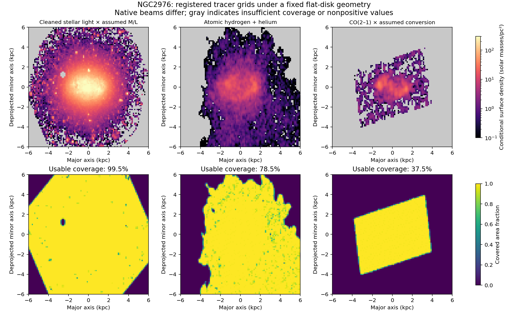

# NGC2976: registered ordinary-matter tracer pilot

The generic source adapter executed **12 geometry/registration/sampling cases**
for NGC2976, producing 36 component grids and 72 conditional mass combinations.
The completed construction is [run-002](run-002/summary.json); the current
diagnostics are in [findings-002](findings-002/summary.json). Nine numerical
tests pass. This adds a second galaxy with a conditional resolved source packet
to the atlas; it adds no gravity field or observed-motion score.

**SOURCE_BLOCKED for observational gravity/3D admission.** These are flat-disk
tracer maps, with native instrumental blurring and assumed conversions. Their
vertical structure and full ordinary-matter content are not observed.

## What the actual source data show

| Quantity, within the nominal tapered region | Result | Interpretation |
|---|---:|---|
| Usable stellar source coverage | 99.53% of area inside 6 kpc | Includes signed faint pixels; this is coverage, not a detection fraction. |
| Usable HI source coverage | 78.50% | Published zeros may be blanked or nondetected; they are not measured empty space. |
| Usable CO source coverage | 37.54% | Most of the selected area has no usable molecular-tracer measurement in this product. |
| Nominal conditional mass | 2.394 billion solar masses | 2.103 stars, 0.185 atomic gas plus helium, 0.106 molecular gas plus helium. |
| Lower/higher conversion alternatives | 1.619 / 3.243 billion solar masses | Illustrative stellar M/L and CO conversion choices at fixed distance, not confidence limits. |
| Distance-scatter alternatives | 1.549 / 3.424 billion solar masses | Catalog distance 3.611 ± 0.707 Mpc used as sensitivity endpoints, not a mean-error posterior. |

The distance cases use the same angular aperture: all physical grid and taper
lengths scale with distance. Their masses scale as distance squared. The nominal
grid spans ±8 kpc, has 0.125 kpc cells, and tapers from 5 to 6 kpc. Neither the
outer taper nor either missing-area prescription is a measurement of exterior
matter. Annular filling stops beyond the last supported annulus; its small
addition does not show that unmeasured material is negligible.


Photometric position-angle shifts of ±0.9 degrees and the tested inclination
alternatives change the untapered cell-by-cell tracer assignments by roughly
6.5–20% in these disk coordinates, while the nominal-conversion integrated mass
changes by less than 0.6%. This is a warning about assigning observed light to
positions in a model disk. It is not a measured change in sky brightness or
gravitational force; a coordinate-dependent map difference is not a gravity score.

Reversing the stellar registration partition changes the stellar grid by 0.72%
in the same L1 diagnostic, and total conditional mass by 0.0021%. That is much
smaller than the mass-conversion and distance alternatives. The two registrations
use the same images, not independent observing epochs.



The plots use different native beams. Their apparent clump sizes must not be
compared as equally resolved physical structure. Stellar absolute/relative
registration comes from the prior Gaia/P1/P5 checks. The mathematical WCS audit
does not provide an empirical absolute or relative astrometric calibration for
the radio/CO maps.

## Data, equations and source assumptions

Input bytes are bound to the existing source-acquisition receipts: S4G P5
cleaned stellar flux and ICA mask, a Gaia-checked S4G P1 reference image, THINGS
natural-weighted HI moment zero, and HERACLES CO(2–1) moment/error maps. Native
headers and pixel values remain unchanged. Source paths and SHA-256 values are
in run-002/summary.json and the frozen configuration.

Primary measurement references are [Querejeta et al.](https://arxiv.org/abs/1410.0009),
[Meidt et al.](https://arxiv.org/abs/1402.5210),
[Salo et al.](https://arxiv.org/abs/1503.06550),
[Walter et al., THINGS](https://arxiv.org/abs/0810.2125) and
[Leroy et al., HERACLES](https://arxiv.org/abs/0905.4742).
The [HERACLES release guide](https://www.iram.fr/ILPA/LP001/README) defines its
temperature scale, errors and masks. Its integration mask uses HI velocity
windows, so the processed source is not independent of all HI kinematics even
though this builder reads no velocity arrays.

The recovered outer ellipse has PA 144.0 degrees and ellipticity 0.401. The
assumed intrinsic axial ratio q0=0.13 yields inclination 53.8623 degrees through
cos²(i)=((1-e)²-q0²)/(1-q0²). q0=0 and 0.25 are separate model alternatives.
This does not measure a disk's vertical profile or make a warped source flat.

P5 positions are transformed exactly through the P1 tangent-plane translation.
The code uses the measured offset in P1 pixels, with no NGC2903 hardcoded shift.
Its composed sky-vector mapping, analytical area Jacobian and subpixel area/flux
deposition are documented in [PREFLIGHT.md](PREFLIGHT.md). The independent
Astropy checks agree to 2.65e-10 arcsec in world coordinates and 2.96e-10 P1 pixel
for translations; independent finite-difference pixel areas agree within
2.27e-10 relative error on the sampled real headers. These check implementation,
not the accuracy of the telescope's astrometric calibration.

Stellar luminosity uses the retained 704.04 Lsun/pc² per MJy/sr convention, then
M/L=0.6 nominally. No cleaned-color regression is applied. HI includes helium
once and the recorded restoring-beam brightness conversion; CO uses
alpha_CO10/R21=4.35/0.65 including helium, with no second helium factor. These
are conditional conversion conventions, not locally measured mass calibrations.
The earlier conversion-metadata audit retains calibration-epoch limitations.

Nonzero ICA labels are excluded. Signed flux survives rebinning and is reported
before nonnegative projection. In the nominal CO grid, clipping negative cells
adds 1.730 million K km/s pc², about 11.3% of the clipped measured CO integral.
That operation can bias faint gas estimates; it is not evidence for extra gas.
The CO error map is carried as an area-weighted native-error diagnostic, not a
new propagated uncertainty or a full spatial covariance.

## Numerical evidence and retained failures

At the fixed 0.125 kpc output grid, one versus four samples per native-pixel
axis changes the stellar/HI/CO maps by 1.73%, 4.16% and 7.85% in L1. Two versus
four reduces this to 0.50%, 1.37% and 2.12%. Annular averages are more stable:
the corresponding two-versus-four differences are 0.017%, 0.024% and 0.072%.
All annular diagnostics stay below the predeclared 3% follow-up flag. Four-way
sampling is a finite-resolution construction; it is not an exact footprint
overlap or a beam-convergence proof. Maximum per-cell area coverage is 1.0145,
which is retained as quadrature discretization rather than hidden by clipping
the stored coverage grid. Display and descriptive area-fraction summaries cap
coverage at one.

The first uniform-field test assumed an inclined image fit inside a 3 kpc box.
It actually lost 2.235% through the boundary. The original test and failure log
are retained at the package root. An enclosing 6 kpc field fixes that test's
assumption; its 1e-12 conservation tolerance and production equations are
unchanged. The separate cropped-field control still verifies nonzero loss.

Run-001 then passed eight tests but stopped at the actual Astropy WCS check:
the legacy header reader represents NAXIS as float, and the moment image retains
extra axes. The independent check now receives an explicit two-axis integer
header, with the declared omission of SIP. A ninth regression test verifies
that handling. Run-001's original inputs and failure receipt are retained;
no source grid or gravity result came from it. Run-002 completes all cases.

Findings-001 is preserved. Its mass-plot legend obscured the last bar's label;
findings-002 changes only legend placement. Both numerical diagnostic summaries
agree; original report code is archived with findings-001. Final plots were
visually inspected. No failed scientific gate was adjusted using galaxy speeds.

## Reproduce and continue

From the repository root, using the existing Python313 environment:

```powershell
python -B scripts/build_mond_atlas_registered_source.py --output work/gravity-first-principles/mond-atlas-generic-source-001/<new-run> --private work/private/mond-atlas-generic-source-001/<new-run>
python -B scripts/report_mond_atlas_registered_source.py --source work/gravity-first-principles/mond-atlas-generic-source-001/<new-run> --output work/gravity-first-principles/mond-atlas-generic-source-001/<new-findings>
python -B -m unittest discover -s tests -p test_mond_atlas_registered_source.py -v
```

All twelve private source packets and their hashes are preserved. No new raw
observations were downloaded by the construction; literature verification used
public source pages. No galaxy motion response, total dynamical mass, halo fit
or lensing mass enters this construction. NGC2976 remains development-exposed.

Next is a consistent source-image reprojection across plausible vertical
profiles, using the already checked common image/field basis. Unknown thickness,
nonuniform calibration, all gas phases, sky background, warp/bulge structure,
source covariance and exterior matter remain unresolved. Only a validated
source/instrument/motion comparison can test a proposed gravity correction.
