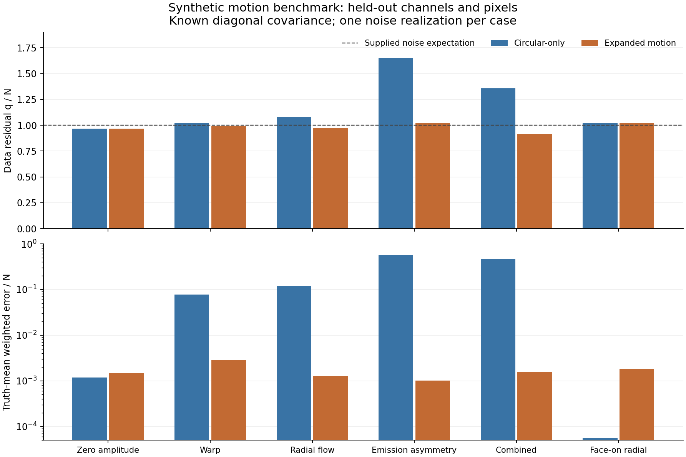

# First executed motion-forward benchmark

**THEORY_BENCHMARK_ONLY; ready for coordinator review.** The final execution is
[run-002](run-002/README.md), with [complete results](run-002/summary.json),
[25 passed numerical controls](run-002/numerical-controls.json), and
[pre-response gate receipt](run-002/response-access-gate.json).
The new motion suite passes 13 tests; the existing offline regression suite passes 17.
No source or observed covariance is admitted, no galaxy motion is scored, and no
gravity score or speed-derived mass is produced. Pressure support remains missing.

The implementation integrates prescribed thin emitting annuli with inclination
and position-angle warps, radial streaming, and azimuthal emission asymmetry. It
uses the existing channel integration and beam primitives without changing them.
Read the [frozen preflight](PREFLIGHT.md), [freeze hashes](freeze.json), and
[configuration](../../../configs/mond_atlas_motion_controls_v1.json) for primary
equations, coordinate/area conventions, assumptions, thresholds and injections.
The independent reference uses Gauss-Legendre radii, offset azimuths, Cartesian
rotation matrices, SciPy Gaussian CDF, direct pixel gathering and direct convolution.

## What the executed injections show

Six cases use separate fixed noise draws and the supplied diagonal covariance,
with 4,704 training cells, 2,646 held-out-channel cells, 2,352 held-out-pixel cells,
and 1,323 jointly held-out cells each. Gaussian noise is added after the instrument.
All source profile parameters, center, flux, asymmetry phase and instrument settings
are known by construction. Two fixed optimization starts are selected by training
error alone; both starts and all results are retained.

| Injection | Joint held-out q/N: circular | Joint held-out q/N: expanded | Circular-only confusion |
|---|---:|---:|---|
| All extra amplitudes zero | 0.9675 | 0.9684 | Expanded freedom slightly worsens prediction |
| Inclination/PA warp of 10/20 deg | 1.0241 | 0.9928 | Global inclination 59.32 vs 55 deg; PA 26.36 vs 18 deg |
| Radial streaming 25 km/s | 1.0774 | 0.9702 | Rotation 105.56 vs 100 km/s; PA 31.23 vs 18 deg |
| Emission asymmetry 0.4 | 1.6497 | 1.0225 | Systemic velocity shifts to 1.41 vs 0 km/s; residual emission remains |
| Warp + streaming + asymmetry | 1.3585 | 0.9154 | PA 34.83 vs 18 deg; line width 8.49 vs 7 km/s |
| Face-on with radial flow 25 km/s | 1.0202 | 1.0195 | Planar velocities unidentifiable despite accurate pixel predictions |

All expanded fits meet the predeclared descriptive prediction criterion on all
three held-out subsets. The first five meet the parameter-error tolerances; the
face-on case does not. Its expanded fit retains rotation 90 vs injected 100 km/s
and radial flow approximately 0 vs 25 km/s, with only 5 of 7 local sensitivity
directions having nonzero rank. This is a known projection degeneracy, not a recovery.
Even the **circular-only warp and radial fits meet the loose prediction criterion**:
improved expanded residuals do not prove unique motion identification. The criterion
averages over all fixed cells, including empty ones, and is not a significance test.
Inclination, PA, warp and streaming sensitivities remain strongly correlated.

The face-on noiseless cube is exactly invariant to planar speed changes. A separate
unresolved-spectrum control finds identical spectra for rotation/radial amplitudes
(100,30) km/s and pure rotation 104.4031 km/s when the radial profiles match and
emission is axisymmetric. Resolved information and independent geometry matter.



[Combined channel images](run-002/combined-channel-images.png) display independent
truth and the prediction-minus-truth residuals. These figures were visually checked.
Single noise realizations and conditional source assumptions do not establish coverage,
observational selection validity, force balance, unique geometry or a dynamics solver.

## Numerical and boundary evidence

All analytic/manufactured gates passed before synthetic data generation. The
production-to-independent-reference relative L1 cube errors at quadrature levels
(24,72), (48,144), (96,288) are 0.0011420, 0.0002586 and 0.00006590. Refining
quadrature at a fixed declared instrument reduces the error. This is a quadrature
convergence check, not validation across a range of real telescope resolutions.
The production rotation law also passes its rigid-rotation limit; face-on, edge-on,
outward-flow sign, channel reversal, intrinsic flux, channel rebinning, length-unit
rescaling and direct convolution controls pass their frozen tolerances.

In a narrow-band/cropped-field control, unit intrinsic flux becomes 0.299011 in
the band and 0.286125 in the final field. Spectral loss is 0.700989 and spatial loss
after the band is 0.012886. The beam exports 0.011274 from the field and imports
0.000782 from the halo. These losses are retained, not renormalized away. A separate
outside-field impulse independently verifies beam in-scatter. The finite sampled
beam is the declared instrument; the continuous Gaussian square-tail diagnostic
for the main beam is 0.00035364. The pixel response is a linear tent, not a top hat.

## Exact files and reproduction

Source files:

- `scripts/mond_atlas_motion_controls.py`
- `scripts/run_mond_atlas_motion_controls.py`
- `configs/mond_atlas_motion_controls_v1.json`
- `tests/test_mond_atlas_motion_controls.py`

From `C:/Users/henry/Documents/Codex/2026-09-04/pu-2/work/Invariant`:

```powershell
& 'C:/Users/henry/AppData/Local/Programs/Python/Python313/python.exe' -B scripts/run_mond_atlas_motion_controls.py
& 'C:/Users/henry/AppData/Local/Programs/Python/Python313/python.exe' -B -m unittest discover -s tests -p test_mond_atlas_motion_controls.py -v
```

The runner creates a fresh run directory and refuses to overwrite old receipts.
Run-001 (24 controls) is retained. Run-002 adds the production-law rigid limit to
the already-declared rigid control and adds plots; its fit settings, injections,
thresholds and frozen config are unchanged. The new control passes, and both
runs give the same case metrics. No failed numerical gate or run was discarded.

Publishable receipts and figures stay in this report directory. Synthetic arrays
are in `work/private/mond-atlas-motion-controls-001/run-002/` (one compressed NPZ
per case), with hashes in each case receipt. Keep that private directory outside
publication. The coordinator owns Git and publication; no Git operation was performed.

Access distinction: the motion runner opens **zero observed source or response
files**. The separate, unchanged offline regression suite includes a historical
SPARC integrity test that programmatically reads three existing observational
assets and checks archive hashes/row strings. Those assets and the exact scope
are recorded in [validation.json](validation.json); they were not used to construct,
fit or choose this benchmark. No claim that the whole session avoided those reads
is made. No new observational covariance or source admission follows from them.
