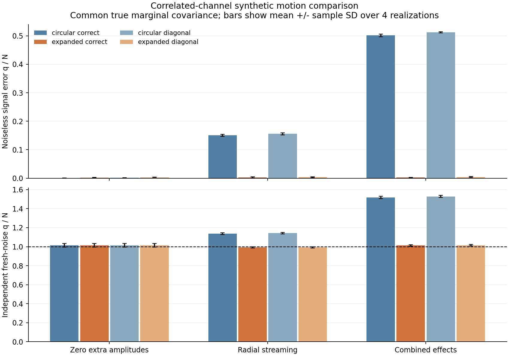
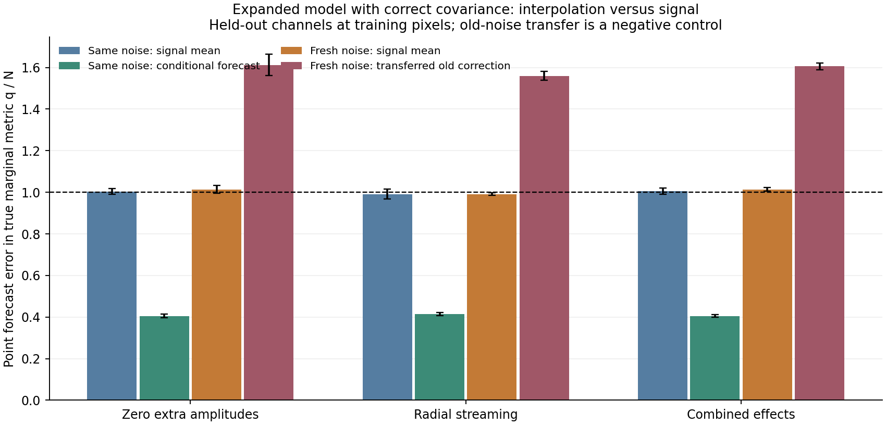

# Executed correlated-channel motion milestone

**THEORY_BENCHMARK_ONLY; ready for coordinator review.** The package extends the
published motion law through read-only import. [Run-001](run-001/README.md) executes
96 fitted models (192 fixed optimization starts) on 12 independent training-noise
cubes and 24 independent fresh-noise cubes. All 30 statistical controls, 25 imported
mechanics controls and 18 new unit tests pass. No observed data were read in this
increment, and there is no source, covariance, selection or gravity admission.

The central result is that **conditional prediction can conceal a wrong motion
model by interpolating correlated residuals**. In the combined injection, the
circular-only model with correct covariance has average same-noise conditional
q/N=1.084, yet its independent fresh-noise q/N=1.517 and noiseless signal error
q/N=0.502. The expanded model reaches fresh q/N=1.013 and signal error q/N=0.00233.
These are fixed synthetic comparisons, not observed motion detections.

## Signal recovery and covariance effects

The table uses held-out channels at training pixels. All signal/fresh comparisons
use the same true marginal covariance; folds are averaged within each realization
before averaging over the four realizations. Every held-out-channel, held-out-pixel
and doubly held-out result, both starts, and parameter errors are retained in the
[fold receipts and complete summary](run-001/summary.json).

| Injection | Circular noiseless q/N | Expanded noiseless q/N | Circular fresh q/N | Expanded fresh q/N |
|---|---:|---:|---:|---:|
| Zero extra amplitudes | 0.000998 | 0.002034 | 1.01302 | 1.01376 |
| Radial streaming 25 km/s | 0.150695 | 0.002590 | 1.13767 | 0.99161 |
| Warp + streaming + asymmetry | 0.501570 | 0.002326 | 1.51740 | 1.01319 |

This table uses correctly specified covariance. The deliberately diagonal methods
retain the true marginal variances and discard channel correlations. Expanded
diagonal fits have noiseless errors 0.002931, 0.003634 and 0.004354 for the three
cases: worse than the correct-covariance fits in every paired realization average,
but with small absolute differences. Their fresh q/N values are 1.01533, 0.99299
and 1.01516. The richer mean model slightly worsens the zero-amplitude result under
both covariance treatments. No uniform benefit from added motion freedom is claimed.

Expanded fits meet the frozen descriptive signal/fresh prediction and parameter
criteria in 8/8 fold fits for each case and covariance method. Circular-only fits
also meet the loose prediction criterion in the radial case, despite failing its
parameter criterion in 8/8 fold fits. Both circular methods fail the combined
prediction criterion in 8/8 fold fits. The eight fits per case/method arise from
only **four independent realizations**, each reused in two overlapping folds.

All selected Jacobians are locally full rank and no selected parameter contacts a
bound. That does not establish unique recovery: expanded sensitivity-column
cosines reach 0.962. Unknown source geometry, radial emission, center, flux,
instrument and covariance were deliberately fixed; relaxing them can add new
degeneracies. The earlier exact face-on and unresolved-flow degeneracy controls
also replay unchanged. Four noise realizations do not establish coverage or
population-level significance; the summary reports paired differences, sample SD,
ranges and every individual realization, without treating pixels/folds as new trials.



## Noise interpolation is measured separately

At a fixed mean, held-out channel noise can be predicted from training residuals
with A=C_HT C_TT^-1. Its conditional covariance is S=C_HH-A C_TH. The implementation
fits only the training marginal C_TT, using Cholesky solves. It never takes the
training block of the full precision or whitens through held-out responses.
The dense control exposes that latter error: correct marginal q=8.5174 versus
incorrect precision-subset q=19.3868.

For the expanded/correct zero-amplitude fit, same-noise point error falls from
1.0040 to 0.4050 after conditioning, measured in the common marginal metric.
The corresponding Schur-normalized q/N is 0.9946, consistent with the separately
tested oracle behavior in this benchmark. Transferring the same residual correction
to fresh noise raises its marginal q/N from 1.0138 to 1.6118. With the exactly known
oracle mean, the corresponding fresh values are 1.0122 and 1.6111. Most of the
same-noise improvement is therefore available without learning any signal at all.

Correct conditional forecast log densities improve on the diagonal approximation
by about 0.600-0.615 nats per held-out channel cell for expanded fits, including
the log determinant. This substantial forecast benefit is mostly about predicting
correlated noise. It must not be reported as a comparable gain in motion recovery.

Fresh realizations have C_H'T=0: their signal forecast uses the marginal C_HH and
no old-noise correction. Completely held-out pixels likewise have no training-noise
correction because the supplied spatial covariance is diagonal. The transferred
correction is retained only as an inappropriate-transfer diagnostic. For a wrong
mean, training residuals contain signal bias as well as noise, so such a correction
is not guaranteed to worsen every possible signal-error statistic.

The three held-out subset scores are each evaluated as their own marginal or
conditional distributions. Pixel-only and doubly held-out subsets at the same
held-out pixels remain mutually correlated; their separate log densities are
**not summed into a fictitious independent full-test likelihood**. Here “doubly
held-out” means held-out channels at held-out pixels, not the union of all test cells.
All fitted-mean forecasts are plug-in diagnostics: covariance formulas are exact
for a fixed mean, while nonlinear parameter uncertainty is not integrated out.



## Protocol, limitations and reproduction

The [preflight](PREFLIGHT.md), [config](../../../configs/mond_atlas_motion_covariance_v1.json)
and [freeze hashes](freeze.json) were saved before implementation and responses.
Primary statistical equations come from Rasmussen & Williams (2006), author-hosted
Appendix A and chapter 2; the independent library check is SciPy's dense Gaussian
log density. Known AR(1) innovations with rho=0.75 generate noise independently of
the covariance factor used by the likelihood. The 8,192-draw oracle moment control,
dense joint-precision Schur checks, diagonal limit and held-out perturbation tests
all pass. [The gate receipt](run-001/response-access-gate.json) precedes study access.

Noise is added after the instrument with independent spatial pixels. The fixed
measurement mask removes pixels where (x+3y)%11=0; it is not selected from emission
or residuals. Missing cells are marginalized and excluded, never imputed as zero.
This does not validate native gas masks, telescope covariance or observed selection.
The imported model still lacks pressure support, force balance, time evolution,
vertical structure, self absorption and observational source uncertainty. Line
width remains prescribed broadening. No gravity score or mass inference is produced.

New source files are exactly:

- `scripts/mond_atlas_motion_covariance.py`
- `scripts/run_mond_atlas_motion_covariance.py`
- `configs/mond_atlas_motion_covariance_v1.json`
- `tests/test_mond_atlas_motion_covariance.py`

From `C:/Users/henry/Documents/Codex/2026-09-04/pu-2/work/Invariant`:

```powershell
& 'C:/Users/henry/AppData/Local/Programs/Python/Python313/python.exe' -B scripts/run_mond_atlas_motion_covariance.py
& 'C:/Users/henry/AppData/Local/Programs/Python/Python313/python.exe' -B -m unittest discover -s tests -p test_mond_atlas_motion_covariance.py -v
```

Execution took 250.6 seconds on CPU with one numerical-library thread. Every run
uses fresh report/private directories and refuses overwrite. The initial control
receipt and full run remain intact; no failed numerical gate, fit or study result
was discarded. No optimizer exception or selected-fit convergence failure occurred.

[Verification](verification.json) rehashes the immutable prior dependencies,
new implementation, run artifacts, three truth packets and twelve noise/prediction
packets. All 36 noise arrays reproduce exactly from their frozen seeds. The
[test receipt](test-validation.json) records 18 passing tests. Additional design
and prediction replay is in artifact-replay-verification.json. Both plots were
visually checked. The publication manifest lists exact new public files/hashes;
synthetic arrays remain in `work/private/mond-atlas-motion-covariance-001/run-001/`
outside publication. No shared module, prior receipt, handoff document or Git state
was changed. The coordinator owns review and publication.
