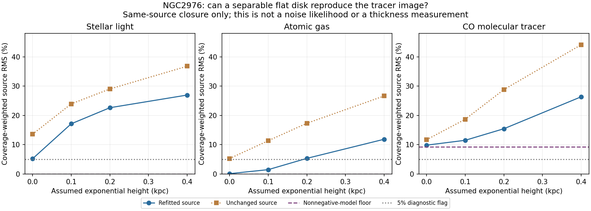

# NGC2976: source reprojection across disk-height alternatives

All **12 source inversions converge** using the unchanged, independently checked
common image/field basis. Ten exceed the frozen 5% descriptive image-mismatch
flag. These are retained source diagnostics, not ten rejected physical models.
The package remains **SOURCE_BLOCKED**, with zero observed-motion scores or
new gravity fields. Five prior projection controls replay successfully before
the registered source packet is opened.

The input is the nominal registered NGC2976 source grid from generic-source-001.
For each tracer, the model uses a nonnegative bilinear planar source and an
exponential vertical profile at height 0.1, 0.2 or 0.4 kpc. Height zero is the
analytic thin-sheet control, not a finite volumetric density suitable for a
three-dimensional field loader. Every height is retained; no best height is
selected. This first pass uses nominal geometry, leaving the separately
executed distance, conversion and orientation alternatives in force.

| Assumed height | Stellar-light RMS | Atomic-gas RMS | CO-tracer RMS |
|---|---:|---:|---:|
| Thin sheet | 5.23% | 0.13% | 9.85% |
| 0.1 kpc | 17.15% | 1.50% | 11.52% |
| 0.2 kpc | 22.63% | 5.35% | 15.46% |
| 0.4 kpc | 26.96% | 11.88% | 26.37% |

RMS is coverage-weighted over the same source image inside 3 kpc. Fits use
available cells inside 5 kpc and source support inside 6 kpc, at 0.125 kpc
spacing. Coverage is not an inverse measurement covariance. These values
diagnose compatibility with a restricted source representation at its current
resolution; they are neither independent predictions nor likelihood scores.



## A useful failure: the CO metric has a floor above the flag

Of 1,760 evaluated CO cells, 411 have negative measured intensity. A nonnegative
model cannot equal a negative measurement. For target y and positive weights w,
its squared error is at least sum(w min(y,0)²). Dividing by sum(w y²) and taking
the square root gives a **9.23% unavoidable RMS floor** here. This accounts for
at least 87.8% of the thin model's squared residual. A 5% flag is therefore
unattainable for CO even before imposing a height or a particular source basis.

Negative measured flux can result from noise/background processing; this audit
does not establish which contribution dominates. It does show why the 5% flag
must not be used as a physical model rejection. A validated signed-data noise
likelihood is needed. Clipping measurements to manufacture a passing source
score would remove the evidence and is not performed.

Stellar and HI values in the reported region have zero such lower bound. The
stellar thin-sheet mismatch is still 5.23%, so spatial representation, residual
source contamination, masks and calibration need investigation before a
thickness claim.

Larger model heights smooth the image more along the projected minor axis and
fit these source maps less closely, even after refitting their planar density.
That identifies a concrete sensitivity to study; it does not measure true
heights, rule out warps or establish a gravity correction. Beams differ between
tracers and remain embedded in the maps. No physical source covariance, beam
deconvolution, missing gas phases or complete 3D matter geometry is supplied.

## Reproducibility

[PREFLIGHT.md](PREFLIGHT.md), freeze.json and
configs/mond_atlas_ngc2976_projection_v1.json bind the source, operator, tests,
heights, masks/support and numerical settings before this source-closure run.
The operator's existing controls include independent line-of-sight integration,
the thin limit, flux/centroid, adjoint and excluded-input mutation tests. No
operator or numerical tolerance changed for NGC2976.

Run-001 completed in 4.77 seconds on one CPU numerical-library thread. It retains
every optimizer trace, source residual, annular result and all twelve private
source packets with hashes. The lower-bound report reads the same packets and
verifies their hashes; its radial diagnostics are saved separately. The plot
was visually checked. Raw arrays remain outside Git.

```powershell
python -B scripts/run_mond_atlas_registered_projection.py --output work/gravity-first-principles/mond-atlas-ngc2976-projection-001/<new-run> --private work/private/mond-atlas-ngc2976-projection-001/<new-run>
python -B scripts/report_mond_atlas_registered_projection.py --source work/gravity-first-principles/mond-atlas-ngc2976-projection-001/<new-run> --output work/gravity-first-principles/mond-atlas-ngc2976-projection-001/<new-report>
```

Next is source-resolution and beam/noise validation, retaining the negative
measurements and testing whether the same conclusions survive those changes.
The current source diagnostics do not admit a new observed gravity comparison.
