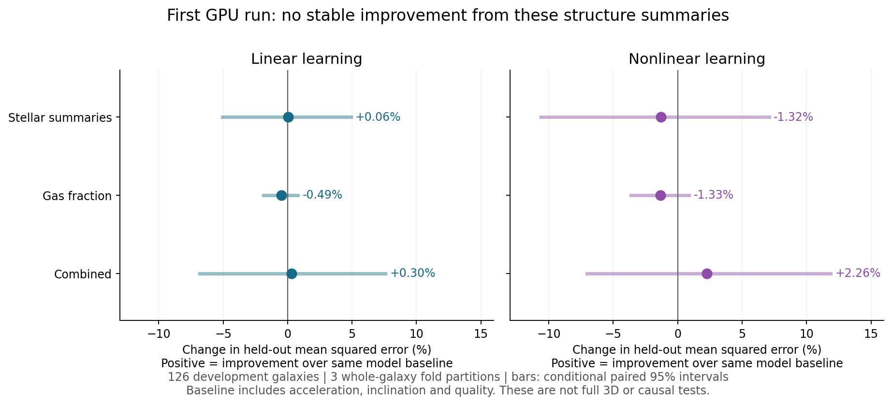

# First executed GPU gravity-pattern experiment

**The CUDA learning path works. These coarse stellar/gas summaries do not yet give a stable improvement in prediction.**



We reanalyzed 126 previously exposed SPARC galaxies. The target is each galaxy's median log observed-speed/fixed-MOND-speed ratio. Predictions use the existing algebraic radial baseline, not a new full-field model. Four feature bundles and two estimators were declared before this run, and all are reported.

| Model | Added information | RMSE (dex) | MSE improvement | Range across the three split seeds |
|---|---|---:|---:|---:|
| linear_ridge | baseline | 0.07654 | +0.00% | +0.00% to +0.00% |
| linear_ridge | stellar | 0.07652 | +0.06% | -2.71% to +2.34% |
| linear_ridge | gas | 0.07673 | -0.49% | -0.53% to -0.45% |
| linear_ridge | combined | 0.07643 | +0.30% | -1.67% to +2.47% |
| rbf_kernel_ridge | baseline | 0.07785 | +0.00% | +0.00% to +0.00% |
| rbf_kernel_ridge | stellar | 0.07836 | -1.32% | -7.62% to +7.38% |
| rbf_kernel_ridge | gas | 0.07836 | -1.33% | -2.04% to -0.76% |
| rbf_kernel_ridge | combined | 0.07696 | +2.26% | -5.33% to +10.29% |

The nonlinear combined case improves mean squared error by 2.26% on average, but changes from a 5.33% loss to a 10.29% gain across splits. Its paired interval includes zero. Stellar summaries alone and gas fraction alone do not reliably help. The combined linear improvement is only 0.30%. These results do not identify a gravity formula or establish that resolved structure is irrelevant.

Features are median/spread of baryonic acceleration, quality and inclination in the baseline; stellar surface brightness, disk scale length and morphology in the stellar bundle; and an HI-plus-fixed-stellar-M/L gas-fraction proxy. No actual ages, 3D clump arrangements or measured exterior fields were available to this experiment.

Every outer test galaxy is excluded from its training and hyperparameter selection. Scaling uses training inputs only. Three deterministic five-fold assignments give 3,024 out-of-fold predictions. Hyperparameters are chosen with the four remaining folds inside each outer training partition. Physical group/survey separation and genuinely unexposed confirmation remain outstanding.

The 16 acceleration-bin structure shuffles have reference fraction 0.0588 for the first seed. This coarse, development-data diagnostic is not a calibrated discovery p-value. It does not override the unstable cross-seed result or the six added-structure comparisons.

The GPU/CPU predictions agree within 2.2e-15, and a separate scikit-learn implementation agrees within 2.9e-15. A planted nonlinear signal is recovered on synthetic held-out examples with RMSE 0.109 times the constant-mean baseline. That validates learning machinery on its known control, not a physical discovery. Tests also verify galaxy identity partitioning, response leakage prevention, constant targets and unit rescaling.

Actual runtime: NVIDIA GeForce RTX 5090, CuPy 13.5.1, Python 3.13.5. The nested fitting and shuffle stage took 4.40 seconds after initialization; the memory pool was limited to 1 GiB. This small workload does not demonstrate a GPU speedup. The installed PyTorch build is CPU-only; no PyTorch CUDA success is claimed.

Reproduce with Python313 from the recorded runtime:

```text
python -m unittest discover -s tests -p "test_mond_atlas_pattern_learning.py" -v
python scripts/run_mond_atlas_pattern_learning.py --backend cuda --output <new-output-directory>
python scripts/report_mond_atlas_pattern_learning.py --source <run-directory> --output <new-report-directory>
```

Raw observations remain outside Git. This learning pass consumes only the previously computed radial galaxy summary. Source acquisition, native selection and a direct-observable lensing pilot run as separate tasks; resolved fields and a motion/lensing theory require their own validation. See [task plan](../../../docs/GRAVITY_PATTERN_SYSTEM_TASKS.md).

References: [SPARC measurement paper](https://arxiv.org/abs/1606.09251); [independent kernel-ridge implementation](https://scikit-learn.org/stable/modules/generated/sklearn.kernel_ridge.KernelRidge.html).
