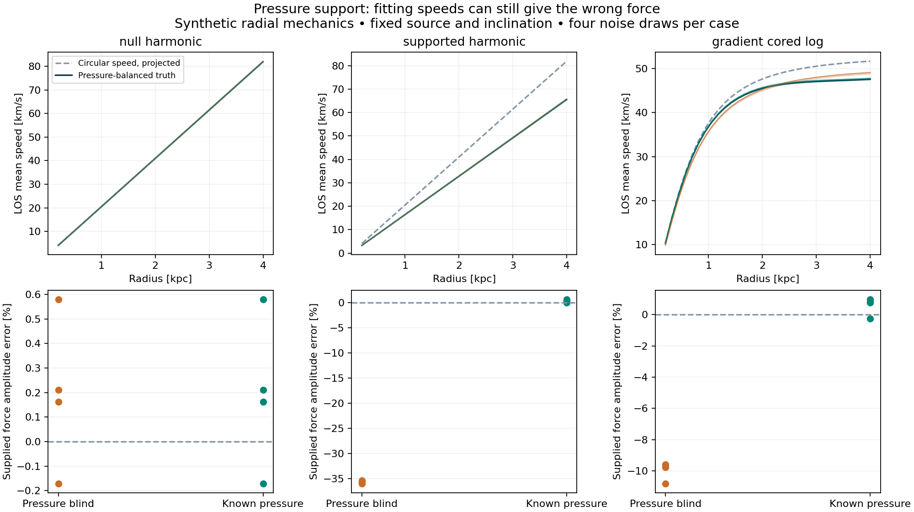

# Pressure support and force recovery: bounded T6 milestone

**THEORY_BENCHMARK_ONLY. Ready for parent review.** A restricted steady gas
pressure closure passes 42 numerical controls and 21 tests. The frozen study
contains 24 noisy fits, six noiseless fits and one deliberately impossible
equilibrium. All fits converge; all expected rejections and signed invalid
values are retained. No observed source or velocity files were opened, no cube
path was added, and no new gravity law or galaxy result is claimed.

The main finding is an exact counterexample to identifying force from a good
speed fit. In the supported harmonic case, pressure-blind fitting recovers a
force amplitude of 400 instead of the supplied 625, while reproducing the
noiseless speeds to numerical precision. Knowing the pressure restores 625.
Without an independently supplied pressure closure, this is a force-pressure
degeneracy, not a unique force measurement.

## Executed study

Run-001 contains the pre-study numerical admission pass. Run-002 repeats the
same gates before generating study responses. There are 32 radial samples from
0.2 to 4 kpc, fixed inclination 55 degrees, zero systemic speed, four noise
realizations per case, and known independent Gaussian LOS speed errors of
0.6 km/s. Sixteen alternating radii train one potential amplitude; sixteen are
held out. Each realization also has an independent fresh-noise packet. Source
shape, pressure and viewing geometry are fixed. The fit uses Gaussian errors
on speed, without treating squared noisy speed as Gaussian.

The following values are means over four realizations. Force error is the
fractional error of the supplied potential amplitude; it is also the force
normalization error because the potential shape is fixed. q/N divides squared
whitened residuals by the number of evaluated samples, without a degrees-of-
freedom correction or parameter-uncertainty marginalization.

| Case | Closure | Force error | Signal RMSE, km/s | Heldout q/N | Fresh heldout q/N |
|---|---|---:|---:|---:|---:|
| Null harmonic | Pressure blind | +0.195% | 0.0685 | 1.271 | 0.822 |
| Null harmonic | Known pressure | +0.195% | 0.0685 | 1.271 | 0.822 |
| Supported harmonic | Pressure blind | -35.699% | 0.0918 | 0.906 | 1.007 |
| Supported harmonic | Known pressure | +0.301% | 0.0918 | 0.906 | 1.007 |
| Varying-pressure cored log | Pressure blind | -9.986% | 0.9365 | 4.278 | 3.666 |
| Varying-pressure cored log | Known pressure | +0.580% | 0.1643 | 1.223 | 1.037 |

The null models have identical pressure and predictions. The supported harmonic
models also have identical prediction families after reparameterizing amplitude:
fresh data cannot break this exact degeneracy. In the cored-log case, omitting
the pressure gradient also distorts the shape. Its noiseless pressure-blind
amplitude is 3778.4933 instead of 4225 (-10.568%), with 0.9161 km/s signal RMSE.
Known-pressure noiseless recovery has maximum relative amplitude error
3.72e-9 across the three cases. These four-draw summaries are conditional
diagnostics, not population significance or an observational gravity score.



Every fit, optimizer status, bounds, seed and metric is in `run-002/fits.json`
and `run-002/summary.json`. No fits failed or reached their bounds. The impossible
harmonic case has negative vphi squared at all 32 sampled radii, reaching
-7777.78 (km/s)^2. It has status `NO_STEADY_CIRCULAR_SOLUTION`, with signed arrays
saved privately and no speed or fit manufactured from them.

## Admitted equations and physical limits

For local volume density rho and scalar pressure P, radial Euler balance is

`vphi^2 = R * [partial_R Phi + (partial_R P)/rho]`.

For a column with height-independent rotation, `Sigma = integral rho dz`,
`Pi = integral P dz = Sigma*c_eff^2`, and
`g_bar = integral rho*partial_R Phi dz / Sigma`, it becomes

`vphi^2 = R*g_bar + R*(partial_R Pi)/Sigma = vc^2 - D`,
`D = -R*(partial_R Pi)/Sigma`, `vc^2 = R*g_bar`.

Positive g denotes the inward force magnitude; actual radial acceleration is
negative. Declining pressure makes D positive and reduces required rotation.
Increasing pressure gives negative D and super-circular rotation. No sign is
clamped. `SurfaceColumn` and `VolumeLayer` are distinct types. The code rejects
passing either to the other's balance function. It cannot infer whether an
arbitrary caller supplied the physically correct averaged force; that remains
an explicit input responsibility.

The equations follow the steady radial/vertical Euler formulation and isothermal
gas equilibrium in [Wang et al. (2010), arXiv:1004.5593v1](https://arxiv.org/pdf/1004.5593),
equations (1), (2), (6), (9) and Appendix A. The gas asymmetric-drift sign and
pressure-gradient form are also bound to [Iorio et al. (2017), section 4.3,
equations (6)-(7)](https://arxiv.org/pdf/1611.03865),
doi:10.1093/mnras/stw3285. These equation references admit mechanics benchmarks;
no observational measurements from those papers enter this package. A general
anisotropic stellar Jeans solver is not implemented.

The closure assumes zero mean radial and vertical flow, axisymmetry, steady
state, inviscid dynamics and isotropic stress. Source-free steady continuity
requires `R*Sigma*u_R = constant`; a regular center without a sink sets that
constant to zero. Nonzero mean flow is rejected. A radial flow, even one that
preserves annular mass flux, would require separate angular-momentum and torque
checks before admission.

Thermal supporting variance is `kT / mean gas-particle mass`; the scalar
Reynolds stress adds one-component isotropic turbulent variance. Thermal line
broadening instead uses the tracer mass. Under explicitly independent Gaussian
components, the spectral variance adds thermal tracer, turbulent, instrumental
and unresolved terms. The last two do not automatically support the gas. The
tests exhibit equal line variance 360 (km/s)^2 with supporting variances 324
and 100 (km/s)^2. One line width does not identify a pressure tensor, its radial
gradient, the thermal fraction, or the correction D.

The three study profiles are prescribed radial surface-fluid closures. They
are not a reconstructed three-dimensional source. The varying-dispersion case
has no supplied vertical or energy closure and therefore does not certify a
finite-height three-dimensional equilibrium; a real baroclinic gas may have
vertical shear. Only the separate constant-dispersion flaring manufactured
control closes both radial and vertical Euler balance. No self-gravity,
Poisson, cooling, heating or turbulent energy evolution is solved.

The radial profiles have a regular center and continue outside the sampling
window. The outer pressure is nonzero and fixed by that continuation; the outer
sample is not a vacuum free edge. The impossible case is a failed circular
equilibrium under these assumptions, not a numerical speed that can be repaired
by clipping. Its actual evolution is outside this steady closure.

## Independent benchmarks and verification

The supplied potentials are `Phi = Omega^2 R^2/2` and
`Phi = V0^2 log(1 + R^2/a^2)/2`. Gaussian Sigma and Gaussian or constant
supporting variance give independently expressed closed rotation-squared
oracles. Finite differences of scalar potential and integrated pressure check
the production analytic gradients. Resolution 33, 65, 129 and 257 reduces the
scaled maximum pressure-derivative error, including boundaries, from 0.0021382
to 0.0000334345 (approximately second order). The last outer-boundary error is
0.0000180304. Tolerances were frozen before implementation and were not changed.

The independent flaring control has
`h = h0 exp(R^2/(4 Lh^2))`, `rho = Sigma exp(-z^2/(2h^2))/(sqrt(2*pi)*h)`,
`P = c^2*rho`, and `Phi = Omega^2 R^2/2 + c^2*z^2/(2*h(R)^2)`.
Its exact rotation is
`vphi^2 = R^2 * [Omega^2 - c^2/L_Sigma^2 - c^2/(2 Lh^2)]`.
Direct quadrature to 8 scale heights agrees to 1.4e-15 after retaining the tiny
tail loss; the 6-height errors are also recorded. Finite differences at fixed
physical height check the radial derivatives; independent vertical finite
differences close hydrostatic balance to 3.34e-9 in the recorded scaled metric.
Using the midplane force with surface pressure misses
`R*c^2*dln(h)/dR`, exactly as the control demonstrates.

The 42 controls also cover dimensions, normalization, the pressureless limit,
pressure signs, regular-center limits, nonregular-center rejection, incompatible
column types, impossible equilibria, thermal/tracer conversion, stress
anisotropy and flow rejection. `unit-tests-attempt-001.log` records 21 passing
tests with no failures, errors or skips. No legacy observation-reading suite
was rerun for this increment.

`verification.json` records exact replay of all 24 noise arrays, 30 fitted
prediction arrays, three truth packets, 120 fit diagnostics and the signed
invalid case. It also verifies 32 run-manifest entries and all 125 bound files
from the prior motion/covariance packages. Exact replay checks reproducibility;
the analytic, finite-difference and quadrature controls supply correctness
evidence. The figure was rendered and visually inspected. NumPy and SciPy BLAS
both report one thread; no GPU was used.

## Freeze, ownership and reproduction

The preflight was frozen at `2026-09-06T18:29:33.071983+00:00`, while the new
implementation and test files were absent. Run-002 admitted controls at
`2026-09-06T18:34:20.848169+00:00`, before generating its first study response at
`2026-09-06T18:34:20.848934+00:00`. These are synthetic responses; no observed
source or velocity file is an input. The paper equations were read through the
web; no local paper binary is claimed or assigned a fabricated hash.

New owned paths only: the two pressure-support scripts, v1 config, new test,
this report directory, and the corresponding private directory. Prior packages
were not edited and their 125 bound files remain hash-identical. No Git
operations or changes to shared handoff files were made.

| File | SHA-256 |
|---|---|
| Config | `514c385cdcc33f3b86ae6a6a2a3ffe61118f5ff6d5f66f87a865adf63010d982` |
| Freeze | `175eacf43a91d449b282e8ef5bc30645f65a294c22917e57c88880e014aa9a3c` |
| Core module | `40b144f040664541993eae4645e847693a7f63482eeefdff76fed440a5e343de` |
| Runner | `3e46b8f2c0787bc1dc42031c1ce018ca44cda9e2b056f53c86e1204adb2b3c85` |
| Tests | `f5506a7ec70e9a0fedfc39101b4f30dc04afe072c41619bda7ec9affbbaac12a` |

From the repository root, execute these PowerShell commands. New runs and
verification outputs must have unused names; existing results are never
overwritten. The scripts enforce one CPU thread. The replay command verifies
run-002 without generating another study.

```powershell
Set-Location 'C:\Users\henry\Documents\Codex\2026-09-04\pu-2\work\Invariant'
& 'C:/Users/henry/AppData/Local/Programs/Python/Python313/python.exe' -B -m unittest discover -s tests -p test_mond_atlas_pressure_support.py -v
& 'C:/Users/henry/AppData/Local/Programs/Python/Python313/python.exe' -B work/gravity-first-principles/mond-atlas-pressure-support-001/verify_replay.py --run-id run-002 --output-name verification-parent.json
& 'C:/Users/henry/AppData/Local/Programs/Python/Python313/python.exe' -B scripts/run_mond_atlas_pressure_support.py --run-id run-003
```

The aggregate `manifest.json` separates public deliverables from 23 private
synthetic NPZ packets. Raw arrays belong only in the private tree. Remaining
closures are observational stress and linewidth decomposition, pressure/source
and inclination uncertainty, vertical force averaging, transport/torques,
energy balance, nonthermal or anisotropic stresses, source self-gravity,
boundary matching and cube/beam/selection inference. The larger gravity goal
remains active. This bounded increment stops for parent review.
