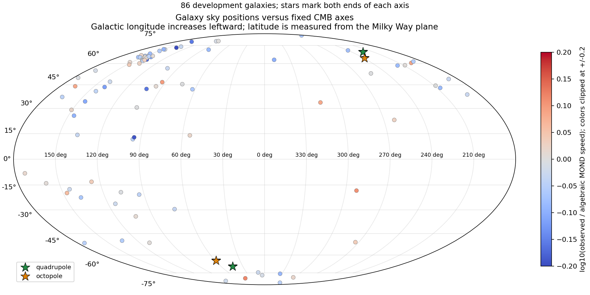

# Fixed CMB axes and galaxy sky positions

The first test finds no useful association specifically with the tested CMB
quadrupole/octopole axes. A modest general sky-position relationship remains
worth checking against observing provenance and coverage. It is not a gravity
mechanism or confirmation of cosmic anisotropy.

## Definition and data

The CMB "axis of evil" refers to anomalous alignments in large-angular-scale
microwave-background statistics; it is not an established force direction.
There is no unique axis independent of statistic, map and correction. We fixed
the [Planck 2013 XXIII Table 18](https://arxiv.org/html/1303.5083#S5.T18)
SMICA kinematic-quadrupole-corrected quadrupole (l,b)=(224.2,69.2) and octopole
(239.0,64.3) degrees, plus their normalized bisector as a sensitivity direction.
These directions are approximately 7.63 degrees apart. This is a specific
published definition, not every historical variant of the anomaly.

86 of the existing 126 development galaxies match uniquely and directly to the
[PROBES-I](https://arxiv.org/abs/2209.09912) table with J2000 coordinates,
distance and catalog ext_r foreground-extinction estimate. Forty are excluded
for absent direct matches; none are excluded on the basis of the residual.
The broader merged catalog had 88 positions, but this run requires the direct
PROBES provenance. Original table values, names and row numbers are retained.

We converted J2000 FK5 sky positions to Galactic and J2000 barycentric mean
ecliptic coordinates. Axis alignment is P2(n dot a)=[3(n dot a)^2-1]/2: both
ends of the axis count equally. Signed dot products separately test hemispheric
behavior. This tests a galaxy's line of sight from us, not its disk normal,
spin handedness or location inside the Milky Way. Galactic latitude measures
angle from our Galaxy's plane; these external galaxies are not in that plane.
Inclination to our line of sight is included as a control, but is insufficient
to determine a full spin direction without a reliable position angle and
additional orientation information.

## Outcomes

Target: existing median log10(observed speed / algebraic MOND speed).
Controls: acceleration and its spread, quality, inclination, stellar brightness,
disk size, morphology, gas fraction, log distance and catalog extinction.

| Direction statistic | Adjusted correlation r | Ten-test maximum-statistic shuffle reference |
|---|---:|---:|
| Quadrupole axial alignment | -0.042 | 0.998 |
| Octopole axial alignment | -0.020 | 1.000 |
| Bisector axial alignment | -0.031 | 1.000 |
| Signed Galactic latitude | -0.170 | 0.455 |
| Distance from Galactic plane, abs(sin b) | -0.075 | 0.942 |
| Ecliptic axial alignment | -0.118 | 0.772 |
| Signed equatorial declination | -0.276 | 0.070 |

All ten columns, including signed CMB directions, are in associations.csv.
The 1,999 residual shuffles preserve sky positions and compare with the largest
absolute correlation among the ten tests. These fractions are descriptive,
not confirmatory p-values: spatial dependence, unequal uncertainty, incomplete
nuisance models, historical exposure and sample selection remain. The strongest
correlation concerns Earth's equatorial coordinates, not the CMB axes.

More stringent controls for Galactic latitude, ecliptic position and declination
leave quadrupole/octopole axial correlations -0.030/-0.089. They also remove
86-90% of axial predictor variance and 97-98% of signed CMB predictor variance.
This illustrates serious directional confounding, not a clean causal separation.

Independent prediction tests use nested ridge penalties and training-only
standardization, with identical galaxies/partitions for each comparison:

| Added direction information | MSE change across 3 galaxy splits | Galactic-sector holdout |
|---|---|---|
| Quadrupole signed + axial | 1.76-2.40% worse | 1.28% worse |
| Octopole signed + axial | 2.37-3.31% worse | 3.10% worse |
| Galactic signed + absolute latitude | 0.42% better to 0.54% worse | 0.61% better |
| Ecliptic axial | 1.28-5.07% worse | 7.18% worse |
| All ten sky terms | 0.39-5.09% better | 3.82% better |

The all-sky improvement is exploratory and cannot be assigned to a physical
cause. Redundant sky columns and correlated controls also affect ridge fits.
Neither error bars for a confirmed effect nor a physical-group-independent
test are supplied. The best bundle among these comparisons is not a discovery.

The eight equal-area Galactic octants contain [0,5,14,4,12,2,45,4] galaxies;
45/86 lie in one sector, another is empty. Holding occupied sectors out is
harder than random galaxy splitting: baseline RMSE is .08334 dex versus
.06712-.07201 dex. It does not certify independence of physical groups or
observing surveys. The PROBES provenance labels are 79 SPARC, four SPARC/Courteau97
and three SPARC/Mathewson96, so this is not an independent-survey replication.

## Inspect and reproduce



Stars mark both ends of the fixed axes. Color shows speed residual, not a
direct gravity measurement. `galaxy-axis-angles.csv` lists every galaxy's
angular separation from each unoriented axis: 0 degrees is along either pole,
90 degrees is perpendicular. UGC06614 is 5.62 degrees from the quadrupole axis;
UGC05750, NGC0024 and UGCA442 are about 11 degrees away. Proximity alone does
not imply unusual gravity.

Four pre-access tests pass, including coordinate conversion against an
independent J2000 rotation matrix, antipodal/rotation invariance, independent
residualization/planted signal, and outer-label isolation. Independent sklearn
pipelines reproduce all 132 nested choices and 2,064 held-out predictions to
1.2e-16; ten partial correlations match separate least-squares residualization.

```powershell
python scripts/run_mond_atlas_sky_alignment.py --output work/gravity-first-principles/mond-atlas-sky-alignment-001/run-NEW
python work/gravity-first-principles/mond-atlas-sky-alignment-001/verify_run.py
```

The original run-001 figure is preserved but superseded: its mirrored longitude
ticks were not relabeled and antipodal stars used different automatic colors.
`plot_reviewed.py` corrects both display issues without changing data or scores.
The reviewed map was visually checked. Inputs and code are hash-bound.

Next useful tests are recovering the missing coordinates, identifying actual
rotation-measurement reference groups and instruments, and determining whether
the declination association transfers across those groups. Disk-spin alignment
is a separate study requiring additional orientation data. No new gravity law,
axis-of-evil causal claim or admitted observed full-field likelihood results.
