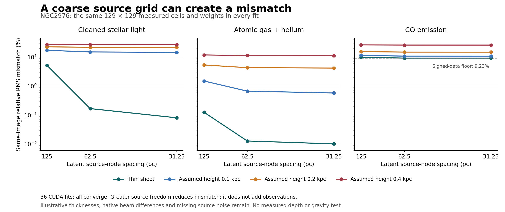

# NGC2976: source resolution on fixed measured pixels

The earlier 5.23% thin-sheet stellar mismatch is strongly dependent on the
source grid. Refining only the latent source from 125 to 31.25 pc lowers it to
0.081%. The observed 129 by 129 cells, their masks, their weights, the assumed
geometry and the fitted/reported radii are identical in all runs. This is a
same-source diagnostic, not a gravity test or independent prediction.

36 float64 CuPy fits on the RTX 5090 all converge, in 16.92 seconds total for
the experiment (excluding startup and benchmarks). Peak default CuPy pool was
19,091,968 bytes; this is pool accounting, not total device/process memory.
No claim of speedup relative to another implementation is made.

## Results

Coverage-weighted relative RMS over the same inner 3 kpc. Values below are
percentages, not likelihoods, statistical errors, or mass uncertainties.

| Tracer | Assumed height (kpc) | 125 pc source | 62.5 pc source | 31.25 pc source |
|---|---:|---:|---:|---:|
| Stellar light | 0.0 | 5.2280 | 0.1675 | 0.0807 |
| Stellar light | 0.1 | 17.1511 | 15.0703 | 14.5735 |
| Stellar light | 0.2 | 22.6348 | 21.8073 | 21.6964 |
| Stellar light | 0.4 | 26.9584 | 26.7023 | 26.6140 |
| HI + helium | 0.0 | 0.1253 | 0.0128 | 0.0102 |
| HI + helium | 0.1 | 1.4983 | 0.6699 | 0.5786 |
| HI + helium | 0.2 | 5.3539 | 4.3240 | 4.1860 |
| HI + helium | 0.4 | 11.8760 | 11.3182 | 11.2361 |
| CO emission | 0.0 | 9.8533 | 9.2343 | 9.2343 |
| CO emission | 0.1 | 11.5156 | 10.7999 | 10.7712 |
| CO emission | 0.2 | 15.4595 | 14.8925 | 14.8474 |
| CO emission | 0.4 | 26.3663 | 26.0348 | 25.9936 |



The CO thin-sheet fit reaches 9.2343%, almost exactly the 9.234263% floor
from negative signed measurements. There are 411 negative cells among 1760
evaluated CO cells. Any nonnegative prediction must miss those cells by at
least their distance from zero. At factor 4, that floor accounts for more
than 99.999% of squared mismatch. Negative values remain in the targets; they
have not been erased to obtain a pass. A validated signed noise/background
model is needed to interpret that residual.

Finite-height models retain substantial discrepancies as the basis is
refined. At an illustrative 0.1 kpc, fine-grid RMS is 14.57% for stellar light,
0.579% for HI, and 10.77% for CO. These restricted separable disk families do
not represent every allowed geometry. Unequal native beams, compact sources,
registration/calibration, missing source covariance and uncertain depth still
matter. The result does not measure a scale height or rule out a physical
galaxy solely on the old descriptive 5% flag.

The finer model has more unknown coefficients than observed cells. It can
fit noise and has unresolved null directions. Low same-image error is not
evidence of observed structure below the image resolution. The change from
factor 2 to 4 is reported for every case; it does not prove continuum inverse
convergence or uniquely recover density. The old 12 fits remain immutable.

## Operator and controls

SOURCE_BLOCKED was frozen before implementation. The analytic rectangular
operator integrates bilinear source tents convolved with a normalized Laplace
minor-axis kernel into the same finite image cells. The zero-height branch
is an exact thin sheet, not a finite-volume density for a 3D force loader.
Source support is fixed by node centers inside 6 kpc; individual hats extend
one spacing beyond each nonzero node. We report inside 3 kpc. No periodic
wrapping is used. The same nearest-neighbor gradient penalty approximates the
same 2D continuum gradient energy; source weights are coverage, not inverse
noise variance. A safe rectangular matrix-norm bound controls FISTA steps.

Eight tests pass before the registered packet is opened:

- Independent tent integration against a Laplace CDF using adaptive quadrature.
- Exact prior square-operator agreement and nested bilinear prolongation.
- Thin limit, length-unit scaling, symmetry, flux and finite-aperture loss.
- Rectangular adjoint, objective derivative and operator-norm bound.
- Independent augmented-design nonnegative least squares.
- CPU/GPU prediction agreement and omitted-target invariance.
- Invalid geometry and optimizer inputs fail closed.

The tests include many cases within the eight test methods; no failed or
skipped benchmark was hidden. Every private fit is rehashed and its projected
image and reported RMS are replayed in verification.json. Public artifacts
contain receipts and summaries; latent/image arrays stay outside Git.

## Reproduce

Use the existing Python/CuPy runtime and source packet bound in freeze.json.
Both output directories must be fresh:

```powershell
python scripts/run_mond_atlas_source_resolution.py --output work/gravity-first-principles/mond-atlas-source-resolution-001/run-NEW --private work/private/mond-atlas-source-resolution-001/run-NEW
python scripts/report_mond_atlas_source_resolution.py --summary work/gravity-first-principles/mond-atlas-source-resolution-001/run-NEW/summary.json --output work/gravity-first-principles/mond-atlas-source-resolution-001/findings-NEW
```

The inherited source provenance is in generic-source-001/run-002. The
measurements and their limitations are documented by
[S4G / Querejeta et al.](https://arxiv.org/abs/1410.0009),
[THINGS / Walter et al.](https://arxiv.org/abs/0810.2125), and
[HERACLES / Leroy et al.](https://arxiv.org/abs/0905.4742). These are projected
tracer measurements, not complete observed 3D mass. No new velocity, lensing
response, or observational download was used in this increment.
