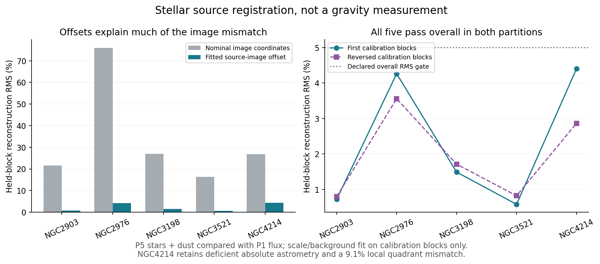

# Relative stellar-map transfer expanded to all five cleaned seeds

All five P5 reconstructions pass the declared overall relative-image gate in both checkerboard partitions. Four also pass the existing finite-footprint Gaia test on P1. **NGC4214 remains unsupported for absolute registration and has a local mismatch.** This is source-registration evidence, not a new gravity result or mass calibration.



| Galaxy | Shift dx, dy (P1 pixels) | Before RMS | After RMS | Reversed RMS | Split shift difference | Prior absolute gate |
|---|---|---:|---:|---:|---:|---|
| NGC2903 | -3.036, -1.171 | 21.52% | 0.72% | 0.80% | 0.054 px | pass |
| NGC2976 | -0.453, -1.661 | 75.97% | 4.26% | 3.56% | 0.114 px | pass |
| NGC3198 | -1.775, -1.537 | 26.92% | 1.49% | 1.71% | 0.101 px | pass |
| NGC3521 | -3.519, -2.010 | 16.27% | 0.58% | 0.82% | 0.075 px | pass |
| NGC4214 | -1.741, -1.554 | 26.89% | 4.40% | 2.86% | 0.151 px | insufficient |

The [publisher P5 specification](https://irsa.ipac.caltech.edu/data/SPITZER/S4G/docs/P5_README.html) identifies stellar and nonstellar components of IRAC1 and describes cutouts and excluded ICA regions. We downloaded the five nonstellar counterparts, verified component units/coordinates and reconstructed their sum. Every nonzero ICA label is excluded; source maps and headers remain unchanged.

The P5-to-P1 mapping explicitly uses the previously selected plain TAN projection. Inherited SIP terms are recorded and ignored for this declared comparison. A separate Astropy core-WCS transform agrees within the frozen 1e-6 pixel tolerance. This does not validate arbitrary distortions or replace the prior Gaia test.

Translations are in P1 pixel coordinates: sample P1 at its nominal mapped coordinates plus dx,dy. Search covers all integer shifts within +/-8 pixels, followed by continuous refinement. Flux scale and background are fitted only to calibration pixels. Brightness selection uses the 80th percentile of calibration P5 reconstructed flux, then the same threshold on validation blocks. A full shift-search finite-footprint margin and ten-pixel block-edge guards keep all shift candidates on the same supported samples.

The first partition uses alternating 80-pixel blocks; the second reverses their roles under a new frozen configuration after the first result. Gates remain RMS below 5%, correlation above 0.99, positive fitted scale and a shift away from the search boundary. Both runs retain per-quadrant diagnostics, optimizer state and source hashes. The two partitions are sensitivity checks on the same exposed data, not independent observations or a posterior uncertainty distribution.

NGC4214 has 9.11% RMS and correlation 0.982 in one first-run validation quadrant despite passing the overall gate. Its P1 finite-footprint Gaia validation remains insufficient. Do not promote it to an absolute source-position pass. NGC2976, NGC3198 and NGC3521 now have explicit relative-transfer evidence in addition to NGC2903. Full source-noise, absolute-flux and 3D-depth admission remains incomplete.

NGC2903 was an already exposed control with historical fixed shift (-3,-1). Its best integer shift reproduces that choice; the new continuous fit and altered source-block selection produce a slightly different estimate. Earlier fields and their fixed shift are preserved. No old fit or hash was silently replaced.

Four numerical tests pass: independent bilinear interpolation; fractional-shift recovery against manufactured images on separate patches; zero-shift/axis convention; and explicit failure for featureless calibration. All prospective bindings for both runs match. Downloaded nonstellar images total 15,644,160 bytes per cached copy; raw files and sample arrays stay under work/private.

Next, use these measured offsets with retained split sensitivity and source masks in additional conditional source ensembles. An alignment pass does not measure stellar mass, remove missing matter, or admit a galaxy motion likelihood.

```text
python scripts/run_mond_atlas_stellar_transfer.py --output <new-first-output>
python scripts/run_mond_atlas_stellar_transfer.py --config configs/mond_atlas_stellar_transfer_v2.json --output <new-reversed-output>
```

For a full replay, use a new private_directory in a copied configuration as well as a new output directory; the recorded private samples belong to these frozen runs. The runner should not be used to overwrite their sample packets.
