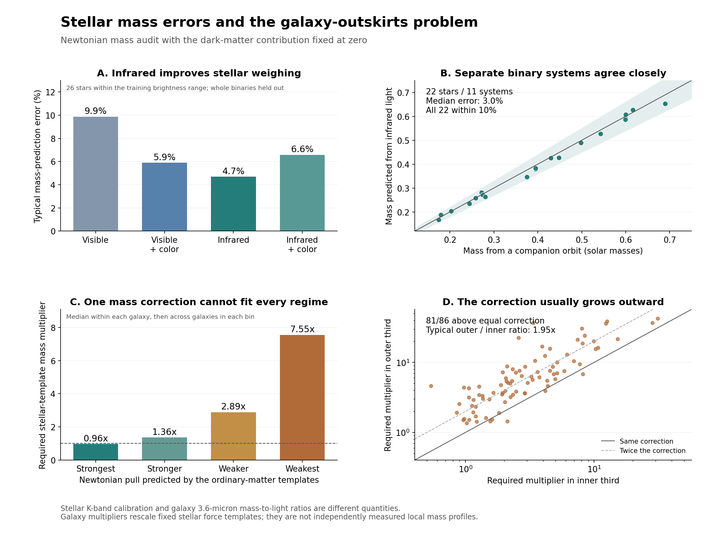

# Stellar mass audit with dark matter fixed to zero

Completed 2026-09-05. The data support useful corrections from light and color, but this analysis does not find an individual-star mass error large enough to explain the galaxy results. The clearest galaxy pattern is that the required correction grows outward and as the predicted ordinary-matter pull becomes weaker.

This is a completed, scoped data audit. It does not establish that every ordinary-matter explanation has been tested, or that a new gravity formula has been found.



## What was actually tested

The physical mass calculations use Newtonian gravity and a dark-matter contribution of exactly zero. No halo or empirical extra-force interpolation was fitted. Binary-star masses come from their mutual orbits. Galaxy rotation curves test the gravitational field of the whole galaxy; they do not weigh individual orbiting stars.

The audit uses 28 nearby stars with both visible and infrared measurements; 62 separate binary systems for a broader infrared calibration; 22 stars in 11 external eclipsing binaries for validation; 86 SPARC galaxies at 1,684 radii; and 585 MaNGA galaxies with transport to 243 other galaxies. These are published observations and existing project development sets. They are not a new, untouched observational confirmation campaign.

## Light and color do matter for stellar mass estimates

We fitted simple light-to-mass relations to the HST binary sample, always withholding both stars of the test binary. Degree and regularization were selected using training binaries only. The figures below are median absolute fractional mass errors, not uncertainty estimates for all stars.

| Inputs | All 28 held-out stars | 26 stars within training brightness range |
|---|---:|---:|
| Visible light | 11.7% | 9.9% |
| Visible light + V-K color | 6.6% | 5.9% |
| Infrared K light | 4.8% | 4.7% |
| Infrared K light + V-K color | 6.7% | 6.6% |

Visible light alone is a worse predictor than infrared light in this sample. Adding V-K color helps the visible-light model. Adding that color to infrared light does not improve this small test. That last negative result prevents treating every extra color as automatically useful.

The two out-of-range cases are GJ22A and GJ1245C. The latter drives much of the all-sample squared-error penalty: the visible-only model overpredicts its mass by a factor of 2.83 when extrapolating beyond the training brightness range. This is an extrapolation failure, not evidence that the measured star is hiding that much mass. The 26-star comparison is an explicitly post-primary domain diagnostic; it leaves the original predictions and complete 28-star results intact. Source: [Benedict et al. 2016](https://arxiv.org/abs/1608.04775).

## Independent stellar mass checks show modest discrepancies

For the broader calibration we predicted the **sum** of the two component masses and compared it with the measured total orbital mass of each of 62 binary systems. We did not create component mass labels using a light-to-mass formula. A fixed fifth-degree relation in absolute Ks magnitude was fitted with monotonicity constraints and evaluated in five whole-system folds.

The held-system median mass error is 3.03%; its RMS fractional error is 6.20%. Restricting the calibration to the 28 systems with orbital mass errors at most 5% gives a 2.27% median error and 3.50% RMS error.

We then froze the fit and predicted 22 stars in 11 eclipsing binaries absent from the calibration systems. These stars span 0.174 to 0.690 solar masses. Their median mass error is **3.02%**, RMS error **3.50%**, and all 22 predictions are within 10% of the orbital masses. The mean prediction bias is -1.83%, too small to justify a multiple-fold increase in individual stellar masses in this sample.

That small bias is not a precision measurement of a universal correction: a coherent one-sigma parallax stress on the calibration systems moves the external predictions by about 4.4%. Absolute magnitude and orbital mass were moved together under that stress because both depend on distance. Resampling confidence intervals are conditional on the predictions and omit the full calibration posterior and systematic uncertainty.

Metallicity does not improve the tested infrared relation. The source flags two L-dwarf metallicities as extrapolated; removing those flags and comparing the same 60 systems gives a -3.1% change in squared prediction error, with a paired interval spanning zero gain. This tests one simple metallicity term over the available nearby populations, not every chemical or activity effect.

External eclipsing masses are independent of the fitted relation, but their separated infrared brightnesses use spectral-template conversion of measured contrasts. This is not completely free of atmosphere/photometry assumptions. The validation stars were also checked in the original publication; our results are a reproducible reanalysis. Source: [Mann et al. 2019 and its data](https://arxiv.org/abs/1811.06938).

## Increasing every star's mass by one factor does not fit the galaxies

For SPARC, the fixed baseline is disk mass-to-light ratio 0.5 and bulge ratio 0.7 at 3.6 microns. With a common stellar multiplier alpha, the tested equation is:

`V_Newton² = gas_scale × Vgas × |Vgas| + alpha × (0.5 × Vdisk² + 0.7 × Vbulge²)`

The signed gas term is retained, including outward contributions from the gas geometry. The fitted alpha range is 0.05 to 40; no galaxy's best common multiplier reaches its upper limit. The ordinary gas template and the stellar geometry stay fixed in the primary run.

A global multiplier learned from other galaxies is **2.97 to 3.46x** across the validation folds. It still leaves a median sampled speed error of **31.0%**. This is a required multiplier estimated from dynamics, not evidence that the stars truly weigh three times more.

Even assigning every galaxy its own best multiplier, using all of its observed radii, leaves a 12.3% median sampled speed error. Only 11 of 86 galaxies have at least 90% of sampled radii within 10% in speed. Allowing separate disk and bulge multipliers lowers the in-sample median error to 10.7%. These fits are diagnostics, not independent validation.

The spatial pattern is more informative: **81 of 86 galaxies require a larger multiplier in their outer third than in their inner third**. The median outer-to-inner ratio is **1.95x**. Calibrating a galaxy's multiplier only on its inner half leaves predictions in its outer half, on average across galaxies, **20.3% too slow**.

| Nominal ordinary-matter acceleration | Galaxies contributing | Required stellar-template multiplier |
|---|---:|---:|
| Strongest: >= 1e-9 m/s² | 9 | 0.96x |
| Stronger: 1e-10 to 1e-9 | 34 | 1.36x |
| Weaker: 1e-11 to 1e-10 | 65 | 2.89x |
| Weakest: < 1e-11 | 57 | 7.55x |

Each bin is summarized within a galaxy before taking a median over galaxies. A galaxy can contribute to several bins. These multipliers answer how much the **entire fixed stellar template** would have to be rescaled to match a particular radius. They are not measurements of local stellar mass density: a disk's gravity depends on matter at many radii.

The outward pattern survives the targeted checks:

| Check | Galaxies | Larger correction outside | Typical outer/inner ratio |
|---|---:|---:|---:|
| Q1 | 57 | 54 | 1.83x |
| inclination_40_75 | 69 | 65 | 2.02x |
| gas_scale_0.5 | 86 | 81 | 2.03x |
| gas_scale_2.0 | 86 | 79 | 1.84x |

Doubling the observed atomic-gas template is a sensitivity test, not a measurement of missing molecular gas. Source: [SPARC observations and mass templates](https://arxiv.org/abs/1606.09251).

## Galaxy colors still predict motion when estimated mass is removed

We removed catalog stellar mass, mass surface density, inferred ages, specific star-formation rate, and the mass-size crossing proxy from the MaNGA model inputs. The baseline uses angular size, projected shape, light concentration, surface brightness, redshift, and signal-to-noise. We then add g-r color, or g-r plus measured spectral summaries.

| Model and extra inputs | Squared-error reduction: 585-galaxy folds | Reduction: separate 243-galaxy sample |
|---|---:|---:|
| ridge; color | 22.8% | 24.7% |
| ridge; color and spectrum | 42.4% | 45.7% |
| trees; color | 15.0% | 21.9% |
| trees; color and spectrum | 27.1% | 24.9% |

Color alone improves the separate-sample result by about 22–25%; replacing redshift with its logarithm to better represent distance scaling still gives about 21%. These percentages are reductions in prediction error, not percentages of missing mass. The response is the spread in stellar velocities, not ordered circular rotation.

This strengthens the case for studying stellar populations. It does not show that mass is misestimated by the amount needed for the SPARC curves. Both MaNGA samples were previously examined; original admission required a valid mass estimate; and spectra and velocity dispersion share a measurement pipeline. This uses available catalog color/spectral summaries, not every raw wavelength or a resolved, independently calibrated stellar census. [SDSS pipeline documentation](https://www.sdss4.org/dr17/manga/manga-analysis-pipeline/)

## What an ordinary-matter explanation still has to demonstrate

The individual-star Ks calibration cannot be multiplied into a galaxy's integrated 3.6-micron mass-to-light ratio. Different wavelengths, populations of faint stars, bright giants, remnants, dust, and spatial gradients intervene. We therefore did not invent such a transfer or call dynamics-fitted galaxy masses independent measurements.

The remaining material explanation needs independently supported changes in the **number, mix, or spatial distribution of stars and gas**, large enough to supply the required outer pull while keeping inner predictions correct. Nearby dwarf-star calibrations give no support here for multiplying every individual star's mass by three to eight. They also do not measure every galaxy's faint-star abundance or remnant inventory.

This audit does not refit a full velocity cube, warps, streaming, pressure support, distance/inclination errors, or their covariance. Nor does it inventory every molecular/hot-gas phase. Those limits leave the broader explanation unresolved. The completed result is narrower: light/color contain real predictive information, but a universal stellar-mass rescaling does not explain the observed galaxy profiles in this zero-dark-matter Newtonian model.

## Reproduction and checks

Source URLs, raw-file hashes, the exact protocol, predictions, galaxy-by-galaxy requirements, and verification results are stored beside this report. Raw observations remain in the ignored private cache. Verification reparses the original stellar source tables, checks binary identities and flux addition, replays all 1,684 Newtonian radius predictions and 828 MaNGA response values, tests that changing held-out targets leaves predictions unchanged, and recovers known injected 50% and threefold mass scales. Computation is table-sized and ran on CPU.

The first attempt stopped at a soft-monotonicity assertion in a binary sensitivity check. It is retained as an incomplete attempt in `stellar-mass-audit-001`; the completed run uses hard linear monotonicity constraints in `stellar-mass-audit-002`. A threaded-tree equality check was changed to an absolute 1e-12 tolerance to allow floating-point summation-order differences; measured changes are recorded in `verification.json`.

To reproduce into a fresh directory, run these scripts with a Python environment containing NumPy, SciPy, scikit-learn, Matplotlib, requests, and threadpoolctl:

```text
python scripts/acquire_gravity_mass_audit.py
python scripts/run_gravity_stellar_mass_audit.py --output work/gravity-first-principles/stellar-mass-audit-replay-001
python scripts/verify_gravity_stellar_mass_audit.py --output work/gravity-first-principles/stellar-mass-audit-replay-001
python scripts/report_gravity_stellar_mass_audit.py --output work/gravity-first-principles/stellar-mass-audit-replay-001
```
